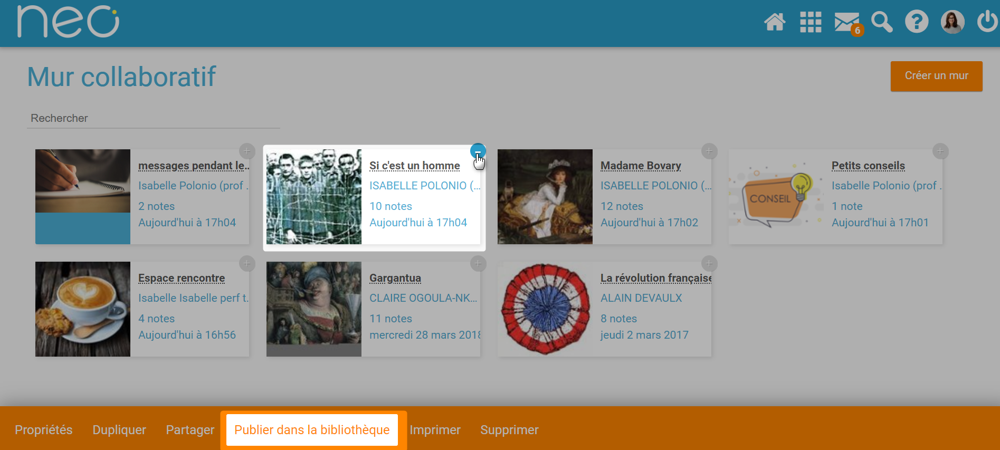
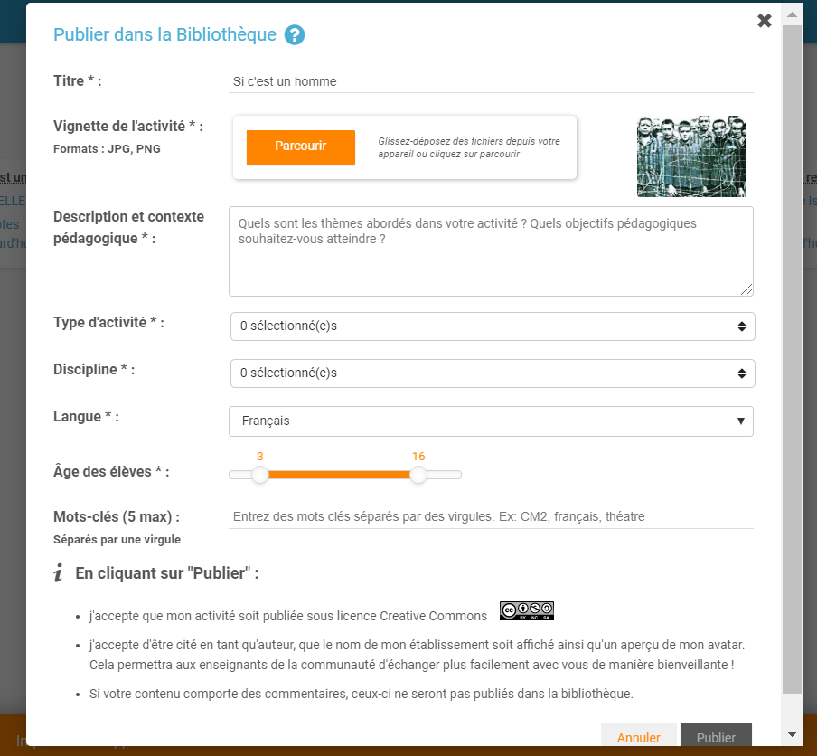
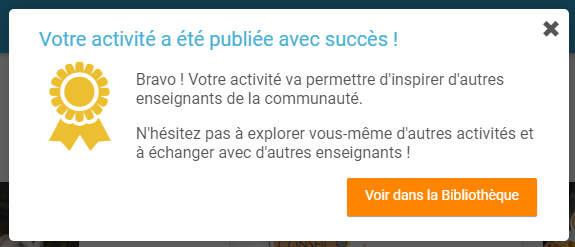
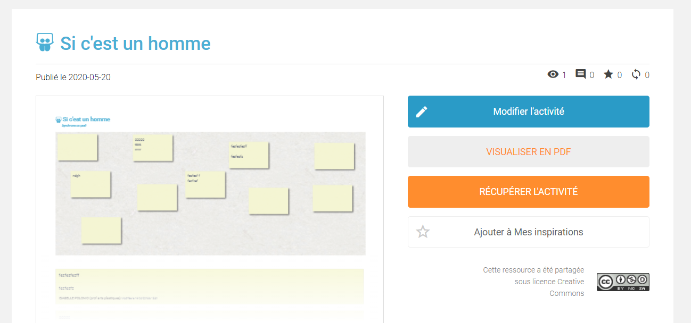

# Mur collaboratif

Brainstormez sur le **Mur collaboratif** ! Épinglez toutes vos notes sur votre tableau virtuel pour vous aider à visualiser l’ensemble de vos idées.

## Présentation

Différents types de contenus \(**son, image, texte, vidéo…**\) peuvent être intégrés dans les notes. Par ailleurs, chaque **note** est accompagnée du **nom de son auteur** et de **sa date et heure de publication**. Une **couleur de note** est automatiquement attribuée pour chaque participant au mur.

## Créer et partager un mur collaboratif

Pour accéder à l’appli Mur collaboratif, cliquez sur l’icône correspondante dans la page « Mes applis ».

Dans le service Mur Collaboratif, cliquez sur « Créer un mur ».

Une nouvelle page apparaît.

1. Saisissez le nom de votre mur
2. Choisissez une vignette d’illustration
3. Saisissez une description
4. Choisissez une image de fond
5. Cliquez sur « Sauvegarder »

Pour partager le mur, cliquez sur le + \(1\) correspondant au mur puis sur « Partager » \(2\).

Dans la fenêtre de partage, vous pouvez donner des droits de lecture, de contribution et de gestion à d’autres personnes sur votre mur. Pour cela, saisissez les premières lettres du nom de l’utilisateur ou du groupe d’utilisateurs que vous recherchez \(1\), sélectionnez le résultat \(2\) et cochez les cases correspondant aux droits que vous souhaitez leur attribuer \(3\).

Les différents droits que vous pouvez attribuer sont les suivants :

* Lecture : l’utilisateur peut visualiser le mur
* Contribution : l’utilisateur peut ajouter des notes sur le mur
* Gestion : l’utilisateur peut modifier, supprimer et partager le mur

Pour valider, cliquez sur le bouton "Partager".

## Ajouter une note au mur collaboratif

Pour créer une note sur un mur, cliquez sur le mur souhaité.

Puis cliquez sur « Nouvelle note ».

Un post-it apparaît, présentant différentes fonctionnalités disponibles sur la partie supérieure droite.  

Pour modifier la couleur de la note, cliquez sur: 

Une palette de couleurs apparait sur la partie supérieure de la page. Cliquez sur la couleur désirée.

Pour afficher l’auteur de la note, cliquez sur: 

Pour ajouter du contenu à la note, cliquez sur: 

Pour supprimer la note, cliquez sur: 

## Dupliquer un mur collaboratif

Cliquez sur le signe + qui se trouve sur le mur dont vous souhaitez faire une copie, puis choisissez l'option "dupliquer" sur le menu.

Vous verrez apparaître un message vous demandant de patienter un moment, puis un deuxième message vous signalant que la copie a été correctement réalisée.

Vous pourrez ensuite vérifier que la copie est bien présente dans votre application.

## **Publier dans la Bibliothèque**

La Bibliothèque est un espace de partage et d’inspiration entre enseignants.

Si vous souhaitez publier votre mur collaboratif dans la bibliothèque pour inspirer d’autres enseignants, il vous suffit de cliquer sur le contenu que vous voulez publier. Le bandeau orange en bas de l’écran s’affiche. Cliquez sur le bouton « Publier dans la bibliothèque ».

Vous devez ensuite renseigner les caractéristiques de votre contenu pour expliquer votre usage :

*  Titre : le plus explicatif possible
*  Vignette : carrée au format JPG ou PNG
* Description et contexte pédagogique : Décrivez l’activité, son contexte, vos intentions pédagogiques, les résultats obtenus… Dites-nous tout ! 
* Type d’activité : activité en classe, à la maison, individuelle, en groupe ? 
* Discipline : Quelle est la discipline concernée par l’activité
* Langue : Dans quelle langue est l’activité ? 
* Âge des élèves : Quel est la tranche d’âge des élèves concernés par l’activité ? 
* Mots-clés : Quels sont les mots-clés qui caractérisent le mieux votre activité ?

Lorsque votre mur collaboratif est publié, vous pouvez le visualiser en cliquant sur “Voir dans la Bibliothèque”.

Vous aurez ensuite la possibilité de modifier les champs saisis ou de supprimer la publication de votre mur collaboratif en cliquant sur “Modifier” depuis la page de votre activité. 

