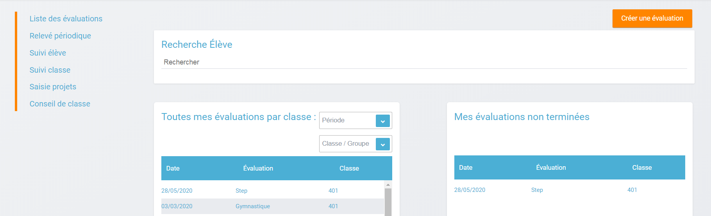
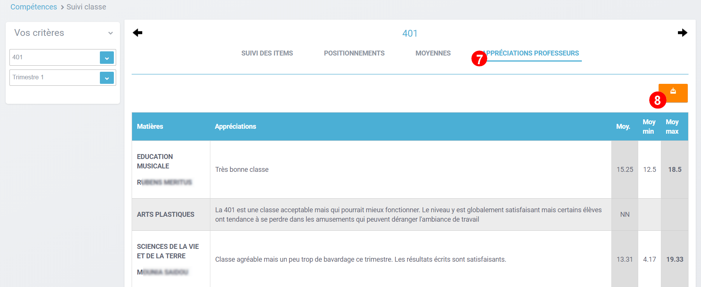
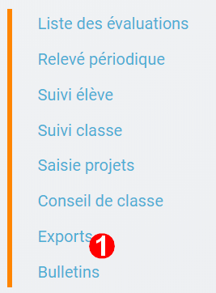
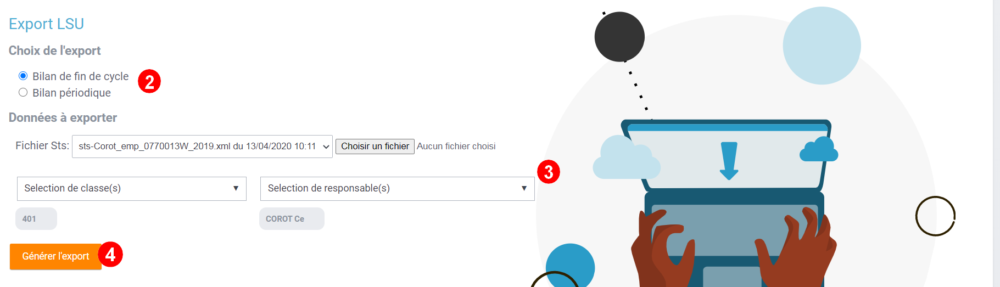
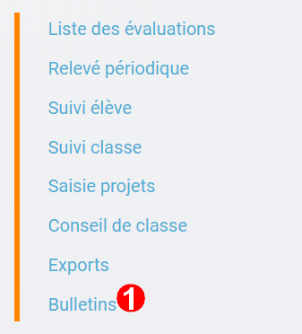
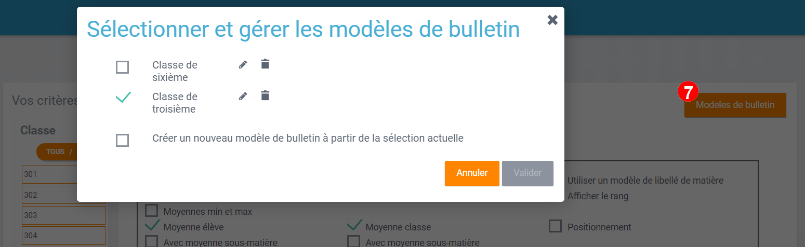

# Compétences

#### Table des matières
<!-- TOC depthFrom:2 depthTo:3 withLinks:1 updateOnSave:1 orderedList:0 -->

- [Présentation](#pr%C3%A9sentation)
- [Créer une évaluation avec des compétences](#cr%C3%A9er-une-%C3%A9valuation-avec-des-comp%C3%A9tences)
- [Évaluer un élève](#%C3%A9valuer-un-%C3%A9l%C3%A8ve)
- [Accéder au relevé de notes](#acc%C3%A9der-au-relev%C3%A9-de-notes)
- [Suivre le niveau des élèves](#suivre-le-niveau-des-%C3%A9l%C3%A8ves)
	- [Visualiser les niveaux d'un élève sur les compétences](#visualiser-les-niveaux-dun-%C3%A9l%C3%A8ve-sur-les-comp%C3%A9tences)
	- [Visualiser le bilan de fin de cycle d'un élève](#visualiser-le-bilan-de-fin-de-cycle-dun-%C3%A9l%C3%A8ve)
	- [Visualiser les notes et le bulletin d'un élève](#visualiser-les-notes-et-le-bulletin-dun-%C3%A9l%C3%A8ve)
- [Suivre le niveau d'une classe](#suivre-le-niveau-dune-classe)
	- [Suivre les niveau de compétences d'une classe](#suivre-les-niveau-de-comp%C3%A9tences-d%E2%80%99une-classe)
	- [Consulter les positionnenents d'une classe](#consulter-les-positionnenents-d%E2%80%99une-classe)
	- [Consulter les moyennes d'une classe](#consulter-les-moyennes-d%E2%80%99une-classe)
	- [Consulter les appréciations des professeurs d'une classe](#consulter-les-appr%C3%A9ciations-des-professeurs-dune-classe)
- [Saisir les projets éducatifs](#saisir-les-projets-%C3%A9ducatifs)
- [Exports LSU (chef d'établissement)](#exports-lsu-chef-d%C3%A9tablissement)
- [Générer les bulletins (chef d'établissement)](#g%C3%A9n%C3%A9rer-les-bulletins-chef-d%C3%A9tablissement)

<!-- /TOC -->

Suivez l'évolution de vos élèves grâce à un outil simple et ergonomique ! Par le biais de **notes numériques ou de compétences**, évaluez vos élèves facilement, consultez leur courbe de progression, et partagez ce suivi avec vos collègues.

## Présentation

Le module permet :

* La **création d’évaluations** avec ou sans compétences
* un **suivi complet de chaque élève** : suivi du niveau évalué par compétences, un accès au bilan de l’élève et un accès au bilan de fin de cycle par domaine
* un **suivi global par classe**: suivi du niveau évalué par compétences pour chaque classe, détail par élève et accès au suivi élève directement depuis la liste
* la mise à disposition d’un **relevé de notes**
* la possibilité de remplacement d’enseignants (pour le chef d’établissement)

## Créer une évaluation avec des compétences

Pour créer une évaluation **avec des compétences**, suivez les étapes suivantes :

* Cliquez sur le bouton **« Nouvelle évaluation » (1)**

* Sélectionner ou saisir les **informations obligatoires** suivantes **(2)** :
  * Établissement
  * Classe ou groupe du cycle 3 ou du cycle 4
  * Matière
  * Type
* **Titre** de l'évaluation et description **(3)**
* Cocher si vous le souhaitez la case **"Activer l'évaluation numérique"** pour évaluer les élèves avec des notes **(4)**
* Modifier si besoin le coefficient et la note maximum
* Choisissez **la période (5)**
  * Date de l'évaluation et date de publication de la note
* Enfin l'option **"Rendre visible les appréciations saisies"** autorise l'affichage ou non des appréciations aux élèves et aux parents - cette option peut être activée directement lors de l'évaluation du devoir.**(6)**

* Cliquer sur l’onglet **"Compétences"** si vous souhaitez ajouter des compétences à l'évaluation **(7)**

* **Filtrer** les enseignements et / ou les domaines - rechercher un item de compétences **(8)**
* Sélectionner des éléments signifiants ou des **items de compétences (9)**
* Visualiser le **résumé de l'évaluation** que vous êtes sur le point de créer - les items de compétences peuvent être ordonnés grâce au glisser/déposer **(10)**
* Cliquer sur **"Enregistrer"** pour sauvegarder l'évaluation **(11)**

***Par défaut, seuls les enseignants sont habilités à créer des évaluations.***

## Évaluer un élève

Pour évaluer les élèves suivez les étapes suivantes :
1. Cliquez sur le menu **"Liste des évaluations" (1)**

2. Renseigner **les critères (2)**

Le nombre des compétences ajoutées et le pourcentage d'avancement d'un devoir (noté ou avec des compétences à évaluer) est visibile directement sur cet écran.

3. Cliquer sur **le devoir à évaluer (3)**

4. Le **détail de l’évaluation** est disponible sur la partie gauche de l’écran **(4)**

5. Si l'évaluation numérique a été activée, il est possible de **mettre des notes à chaque élève dans la colonne résultat** (possibilité d’utiliser le clavier pour se déplacer d’élèves en élèves) **(5)**

6. Si le devoir possède une ou plusieurs compétences, il est possible **d’évaluer les compétences** des élèves avec les pastilles (possibilité d’utiliser le clavier avec les touches de 0 à 4 pour évaluer les compétences)**(6)**
   *  Pastille grise : Compétence non évaluée
   *  Pastille rouge : Maîtrise insuffisante
   *  Pastille orange : Maîtrise fragile
   *  Pastille jaune : Maîtrise satisfaisante
   *  Pastille verte : très bonne maîtrise

Le **détail des compétences** est disponible sur la partie droite de l’écran.

7. Une **appréciation peut être indiquée dans le champ Appréciation (7)**. Si le devoir comprend beaucoup de compétences, l’appréciation est accessible via le bouton :  

Des **exports** vous seront proposés (cartouches - formulaires de saisie vides - les résultats des devoirs)

## Accéder au relevé de notes

Pour accéder au relevé de notes, suivez les étapes suivantes :

1. Cliquez sur le menu **«Relevés périodique » (1)**

2. Renseigner **les critères (2)**

3. Il est possible d’accéder aux **détails des devoirs** en cliquant sur l’entête de l’évaluation (une évaluation avec des compétences est soulignée en orange) **(3)**.

4. Une aide à la saisie est proposée pour la **saisie des éléments du programme travaillés (4)**.

5. Il est possible de **modifier les notes des élèves directement** sur le relevé. La moyenne peut, elle aussi, être ajustée ainsi que les appréciations de chaque élève. **(5)**.

6. L'**affichage du relevé périodique peut être simplifié** en cliquant sur **"<<"** afin de n'afficher que les moyennes et les appréciations des élèves **(6)**.

7. Le **clic sur le détail** pour un élève **(7)** permet de saisir ici également l'appréciation.

Un **rappel des moyennes** est affiché **(8)** et le positionnement calculé est modifiable.
Les **notes détaillées obtenues lors des évaluations** (notes et compétences) apparaissent ici aussi **(9)**.
En bas, on retrouve **l'historique de l'année (10)**.
Le clic sur le **lien "Voir Détails" (11)** affiche le niveau obtenu par compétences de l'élève pour la période et la matière consultée.

Vous pouvez également consulter les **différents graphes** proposés par enseignement ou par domaine du socle **(12)**.

## Suivre le niveau des élèves

Pour suivre le niveau des élèves individuellement, suivez les étapes suivantes :

Cliquez sur le menu **« Suivi élève » (1)**

### Visualiser les niveaux d'un élève sur les compétences

1. Renseigner les **critères pour choisir un élève (2)** - Visualisation de la fiche élève sur la partie gauche de l'écran.

2. L'onglet **Suivi des items** permet de consulter le niveau de l'élève dans chacune des compétences évaluées.En cliquant sur la pastille de la **colonne "Final" (3)** vous pouvez modifier le niveau final de l'élève sur cet item de compétences.

3. Vous pouvez aussi, depuis cet onglet, exporter le relevé de compétences de l'élève ou de la classe (4).

4. Le clic sur la barre de compétences permet d'afficher le **détail des évaluations d'une compétence en particulier (5)**.

Par défaut une **vue graphique** est affichée. Il est cependant possible d’accéder à une vue en liste (4).

L’ajout d’une évaluation libre est également possible sur cette page en cliquant sur **« Ajouter une évaluation libre » (5)**. Elle permet d’évaluer la compétence de l’élève.

### Visualiser le bilan de fin de cycle d'un élève

Pour voir le bilan du niveau des élèves individuellement, suivez les étapes suivantes :

1. Renseigner les **critères pour choisir un élève (1)**

2. Il est possible **d’afficher le bilan de compétences** d’un élève en cliquant sur :  **(2)**

Le bilan de fin de cycle de l’élève est accessible (3) et téléchargeable (4).

Le bilan de fin de cycle peut être visualisé par période : par trimestre, pour l'année en cours ou sur le cycle en cours.

Enfin, la **synthèse du bilan de fin de cycle peut être saisie sur cet écran** ainsi que les enseignements de complément pour les élèves du cycle 4.

### Visualiser les notes et le bulletin d'un élève

Depuis le suivi de l'élève, l'onglet **Suivi des notes (1)** vous permet d'afficher toutes les notes d'un élève et ses moyennes pour la période sélectionnée et de les télécharger (2).
Si le bulletin a déjà été généré par l'établissement, il est aussi possible de l'afficher dans l'onglet **Bulletins (3)**.

Les exports de compétences peuvent être générés **par enseignement ou par domaine** - avec choix de matières et de la période - pour un élève (1) ou pour toute la classe (2).
L'export de relevé de notes est généré pour un élève uniquement (3).

## Suivre le niveau d'une classe

Pour suivre le niveau des compétences de classe, suivez les étapes suivantes :

1. Cliquez sur le menu **« Suivi classe » (1)**

### Suivre les niveau de compétences d'une classe

2. Renseigner les **critères pour choisir une classe et une période (2)**

3. Dans l'onglet **Suivi des items**, pour chaque compétence, le niveau de la classe est affiché sous forme de barre avec différents niveaux de maîtrise atteint par chaque élève (3).

Il est possible de **cliquer sur une compétence** pour afficher la liste des élèves avec leur niveau **(3)**.

4. Il est possible de **filtrer l’affichage des élèves** suivant leur niveau de maîtrise de la compétence.

5. En cliquant sur un élève, s’affiche le **suivi de compétence de l’élève (5)**.

Plusieurs **exports** sont proposés sur l'écran de suivi de classe (6).

### Consulter les positionnenents d'une classe

1. Cliquez sur le menu **« Suivi classe » (1)**

2. Renseigner les **critères pour choisir une classe et une période (2)**

3. Dans l'onglet **Positionnements**(3), le positionnement de chaque élève de la classe pour chaque item de compétences est affiché. Il est possible **d'exporter**(4) ces positionnements.

### Consulter les moyennes d'une classe

4. Dans l'onglet **Moyennes** (5), les moyennes des élèves de la classe dans chaque matière sont affichées. Il est aussi possible **d'exporter** ces moyennes (6).

### Consulter les appréciations des professeurs d'une classe

5. Dans l'onglet **Appréciations professeurs** (7), les appréciations et les moyennes de chaque matière sont affichées pour la classe. Il est possible de les **exporter** (8).

## Saisir les projets éducatifs

Pour saisir les projets éducatifs paramétrés, suivez les étapes suivantes :

* Cliquer sur le menu **"Saisie de projets" (1)**

* Renseigner les critères pour **choisir une période et une classe. (2)**
Tous les projets éducatifs paramétrés pour l'enseignant sur la période choisie et la classe apparaissent **triés par onglet (3)**: EPI, AP et Parcours.

**Saisir les appréciations sur les élèves concernés par les projets (4)** : ces appréciations apparaîtront dans le bilan périodique.
Vous pouvez aussi saisir une **appréciation pour la classe (5)**.

## Exports LSU (chef d'établissement)

Les exports LSU (bilans de fin de cycle et bilans périodiques) sont disponibles via le **menu "Export"**(1).

Choisir le type d'export souhaité (2). Déposer le **fichier STS**, renseigner **les classes** et les **responsables ** (3) puis cliquer sur le bouton **"Générer l'export"** (4)(Il faut qu'au moins un élève de la classe ait un bilan complet :tous les domaines sont évalués - sauf si facultatif - la synthèse est renseignée).

## Générer les bulletins (chef d'établissement)

Pour générer les bulletins, sélectionner le menu **Bulletin**(1).

1. Sélectionner les **critères** (2) et les **options d'affichage** du bulletin (3).

2. Sélectionner les **paramètres** (4) et, si besoin, modifier les **libellés affichés** (5).

3. Générer **l'export des bulletins** (6)

4. Si vous souhaitez sauvegarder les options sélectionnées, vous pouvez **sauvegarder le modèle de bulletin** pour le réutiliser plus tard (7).

