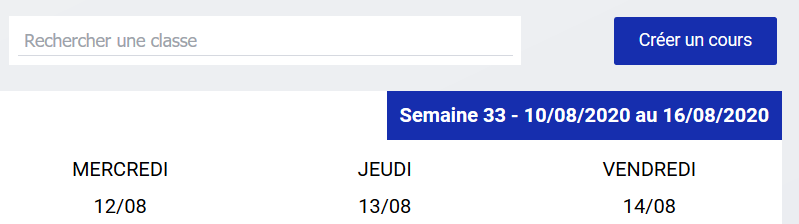
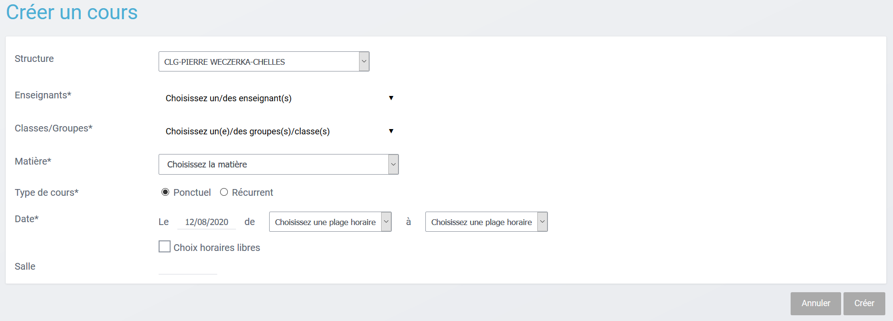
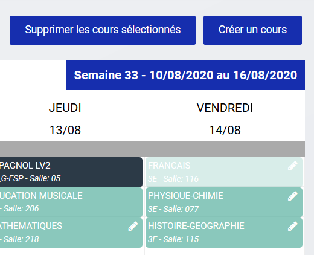
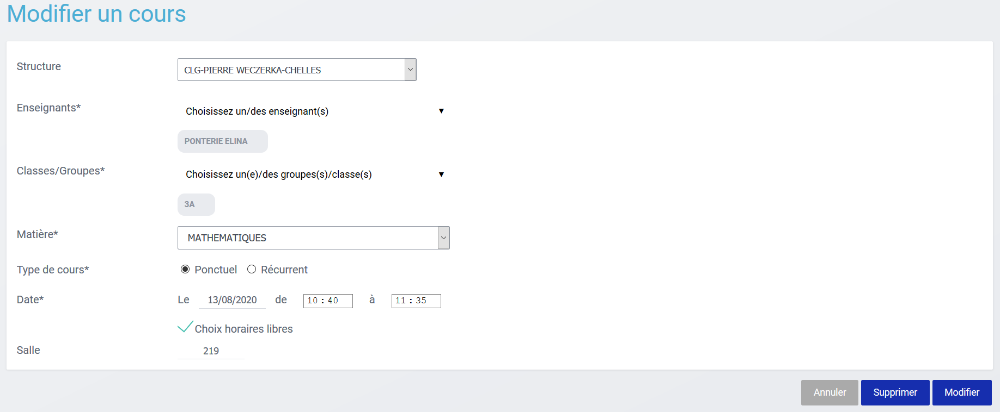

# Emploi du temps

L'emploi du temps est un module qui permet d'afficher les emplois du temps pour les enseignants, parents, élèves et de gérer les cours pour les équipes de vie scolaire.

#### Table des matières
<!-- TOC depthFrom:2 depthTo:3 withLinks:1 updateOnSave:0 orderedList:0 -->

- [Profil Elève et parent](#profil-el%C3%A8ve-et-parent)
- [Profil Enseignant](#profil-enseignant)
- [Profil Vie scolaire](#profil-vie-scolaire)
	- [Les champs de recherche](#les-champs-de-recherche)
	- [Les filtres](#les-filtres)
	- [Créer un cours](#cr%C3%A9er-un-cours)
	- [Modifier un cours](#modifier-un-cours)
	- [Supprimer un cours](#supprimer-un-cours)

<!-- /TOC -->
## Profil Elève et parent
Avec un profil parent ou élève, l'accès au module Emploi du temps permet d'afficher l'emploi du temps de l'élève. C'est une vue calendaire classique qui présentent les différents cours de la semaine.
Il est possible de modifier cette vue pour l'avoir en **vue jour ou en vue mois (1)** et il est possible de **naviguer de semaine en semaine avec les flèches de navigation (2)** ou de **choisir une date (3)**. Il est aussi possible de personnaliser le calendrier en affichant les **quarts d'heure, le samedi et le dimanche (4)**.

## Profil Enseignant
Le module pour les enseignants affiche par défaut l'emploi du temps de l'enseignant mais il est **possible pour lui de chercher l'emploi du temps d'un autre enseignant ou d'une classe, à l'aide des champs de recherche en haut ou des filtres de classes à gauche**.

S'il cumule 2 recherches, les résultats s'ajoutent permettant de distinguer de potentiels créneaux libres en commun.

Attention, **si l'enseignant est multi-établissement**, par défaut lors de la première visite, le **choix "tous mes établissements"** est sélectionné et les champs de recherche ne sont alors pas encore disponibles. **Pour les afficher, sélectionner un établissement**.
Le dernier choix de l'utilisateur sera sauvegardé pour sa prochaine visite.

## Profil Vie scolaire
**Plusieurs profils cohabitent** au sein de l'équipe de vie scolaire.
Les utilisateurs appartenant au **groupe manuel CPE** auront les mêmes droits que les enseignants.
Ceux appartenant au **groupe Admin-VieScolaire** pourront gérer les cours.

### Les champs de recherche

Les champs de recherche "enseignants" permettent de sélectionner un enseignant pour en afficher son emploi du temps. Il est possible de **cumuler plusieurs recherches.**

Le **champ de recherche "classes" active les filtres** disponibles sur la gauche.

### Les filtres

Les filtres sont rangés dans **l'ordre alphabétique** et affichent toutes les classes et tous les groupes de l'établissement.

**Quand on sélectionne une classe, ses sous-groupes qui contiennent au moins un élève s'activent aussi (1)**. Si les sous-groupes dépendant de la classe ne s'allument pas, il faut aller vérifier en console d'administration qu'ils sont bien peuplés avec des élèves.

Il est aussi possible de **ne sélectionner qu'un groupe (2)** ou de désélectionner tout à l'aide du **bouton "Tout désélectionner" (3)**.

### Créer un cours

Si vous disposez des **droits de gestion de l'emploi du temps**, vous verrez apparaître en haut à droite comme sur tous les outils de vie scolaire, un **bouton "Créer un cours"**.

Une fois ce bouton cliqué, une fenêtre s'ouvre vous demandant de remplir plusieurs champs :
- **l'établissement** (si vous êtes multi-établissements)
- **l'enseignant**
- **la classe et/ou les groupes**
- **la discipline** si l'enseignant sélectionné en a plusieurs
- **le type de cours** : ponctuel ou récurrent
- **la date et l'heure** : possible de choisir les créneaux horaires ou des horaires libres
- **la salle**

Si vous choisissez **l'option "cours récurrent"**, vous pourrez définir **différents créneaux de cours sur une semaine** depuis cette même fenêtre.

Validez enfin votre choix pour voir apparaître le cours dans l'emploi du temps.

### Modifier un cours

**Seuls les cours dans le futur peuvent être modifiés**. Ils sont marqués par un petit icône "crayon" et au clic sur ce crayon, 2 possibilités :

- soit il s'agit d'un **cours importé depuis un logiciel d'emploi du temps ou un cours ponctuel** créé depuis le module, donc la page de modification s'ouvre directement
- soit il s'agit d'un **cours créé dans le module emploi du temps et récurrent**, donc une fenêtre s'ouvre pour demander si la modification doit impacter juste ce cours ou toutes les occurences du cours. Une fois le choix fait, la page de modification s'ouvre.

Ces modifications sont immédiatement visibles depuis les profils enseignants, élèves et parents.

### Supprimer un cours

Comme pour la modification, **il n'est pas possible de supprimer des cours dans le passé**.
Pour supprimer un cours il existe **2 méthodes** :
- **clic droit sur le cours** : cela fait apparaître un bouton **"Supprimer les cours sélectionnés"** en haut à droite

- **clic sur le crayon de modification**, puis **en bas à droite cliquer sur "Supprimer"**

Si le cours a été créé dans le module EDT avec une récurrence, au moment de la suppression, une fenêtre vous demandera si vous souhaitez modifier uniquement ce cours ou toutes les occurences.
