# Exercices

Des tests qui ont du peps ! Fini les moues boudeuses à l’annonce d’un exercice ! L’appli **Exercices et évaluations** est un outil de création et de diffusion d’épreuves simples ou interactives. QCM, textes à trous, association d’idées, mise en ordre… Créez vos exercices, ou consultez la bibliothèque, puis, distribuez-les à vos élèves et gérer d’une main de maître vos corrections.

## Présentation

L’appli Exercices et évaluations permet de créer des sujets, de les distribuer et d’en faire automatiquement ou manuellement la correction. Grâce à la Bibliothèque de l’appli, il est notamment possible de rechercher des sujets publiés par d’autres enseignants et de les ajouter à ses sujets personnels pour une réutilisation ou une adaptation.

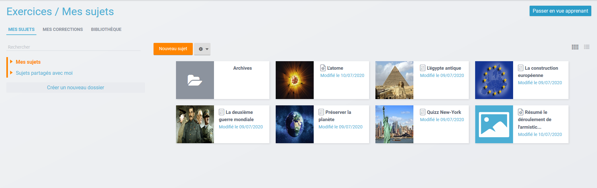

## Élève / Apprenant - Réaliser un exercice

Depuis la page d’accueil, cliquez sur « Mes applis » en haut à droite de l’écran puis cliquez sur « Exercices et évaluations ». Vous retrouvez les sujets à réaliser dans la semaine à gauche de l’écran. Cliquez sur le sujet de votre choix.

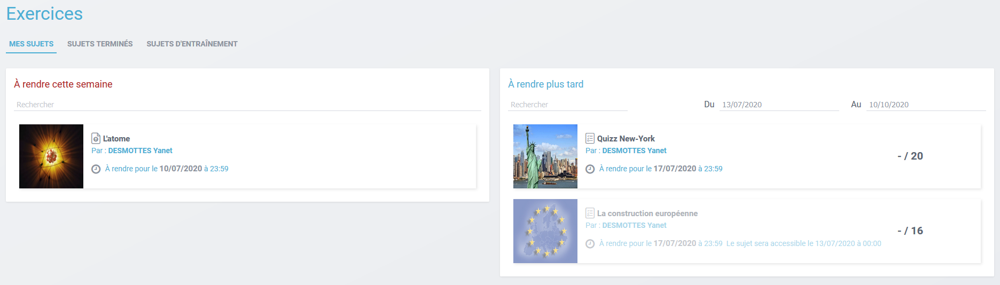

Une présentation du sujet s’affiche précisant la date de rendu \(1\), la durée de réalisation \(2\) et une description de l’exercice \(3\).

Pour réaliser l’exercice, cliquez sur le bouton orange « suivant » en bas à droite de la fenêtre.

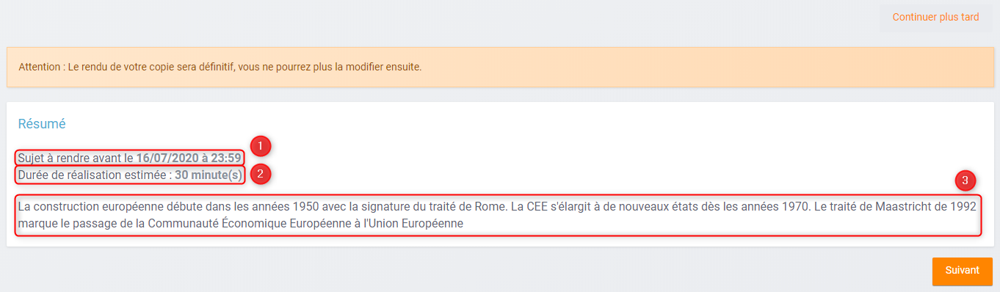

Les questions du sujet s’affichent l’une après l’autre. Il vous suffit d’indiquer la réponse dans le champ réservé \(1\) et de cliquer sur « suivant » \(2\) pour poursuivre l’exercice.

En cas de difficulté à trouver la réponse, une aide peut parfois vous être proposée. Il suffit de cliquer sur le bouton « Aide à la réponse » en haut à droite de l’écran \(3\).

Si vous souhaitez vous interrompre et continuer plus tard l’exercice, vous pouvez cliquer sur le bouton "continuer plus tard".

Dans le cas où la date de rendue de la copie est **dépassée**, le sujet affiché dans la page d’accueil indique à l'élève que la date de rendu est dépassée. L'élève pourra tout de même rendre sa copie, en revanche l'enseignant saura que la copie a été rendue en retard.

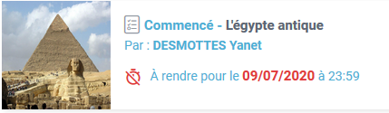

Une fois l’exercice terminé, cliquez sur rendre la copie. Un message de confirmation s’affiche :

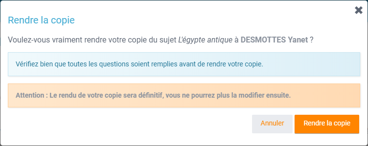

Selon les options choisies par l'enseignant lors de la distribution de l'exercice, vous pourrez modifier votre copie après rendu ou non, dans la limite du délai imparti et de la correction par l’enseignant.

## Élève / Apprenant – Voir la correction d’un exercice

Lorsqu’un exercice est corrigé, vous êtes informés via une publication sur le fil de nouveauté.

Vous pouvez vous rendre sur l’application « Exercices et évaluations », cliquez sur l’onglet « terminés » en haut et à gauche de la page \(1\).

Les sujets corrigés s’affichent.

Cliquez ensuite sur le sujet dont vous souhaitez voir la correction \(2\).

Un résumé s’affiche avec le score final et éventuellement des commentaires formulés par le professeur.

Vous pouvez ensuite accéder au-dessous à la correction par question. Les bonnes réponses s’affichent en vert et les mauvaises en rouge.

## Élève / Apprenant - Réaliser un sujet d'entraînement

Lorsqu'un sujet a été corrigé par l'enseignant, il est possible de le récupérer \(sous réserve que l'enseignant l'ait autorisé\) pour s'entraîner. Vous pouvez cliquer sur l'onglet à droite du bandeau de l'exercice pour récupérer le sujet.

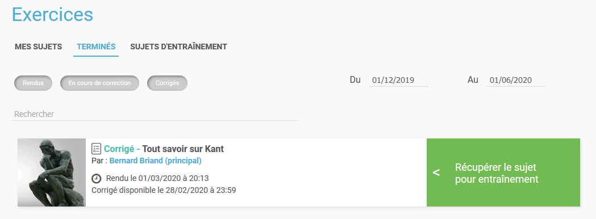

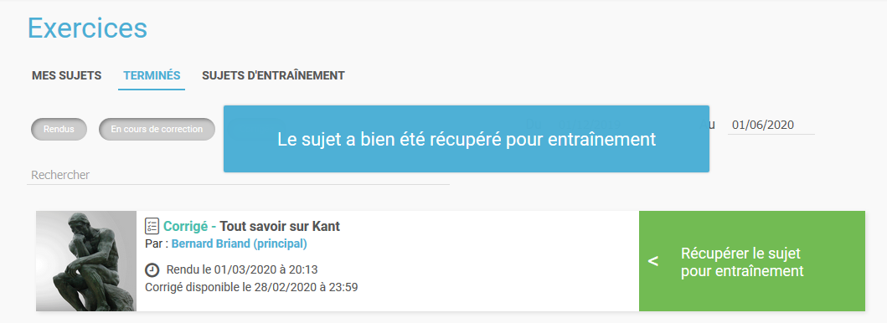

L'exercice repris se trouve ensuite dans l'onglet « Sujets d'entraînement ». Vous pourrez réaliser autant de fois que souhaités ces sujets d'entraînement.

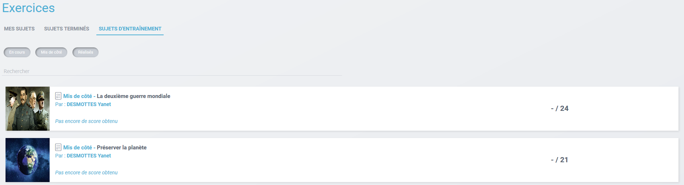

 Une fois le sujet d'entraînement réalisé, vous arrivez sur une page récapitulative où vous pourrez consulter le détail de la correction de la copie \(1\) et recommencer le sujet \(2\).

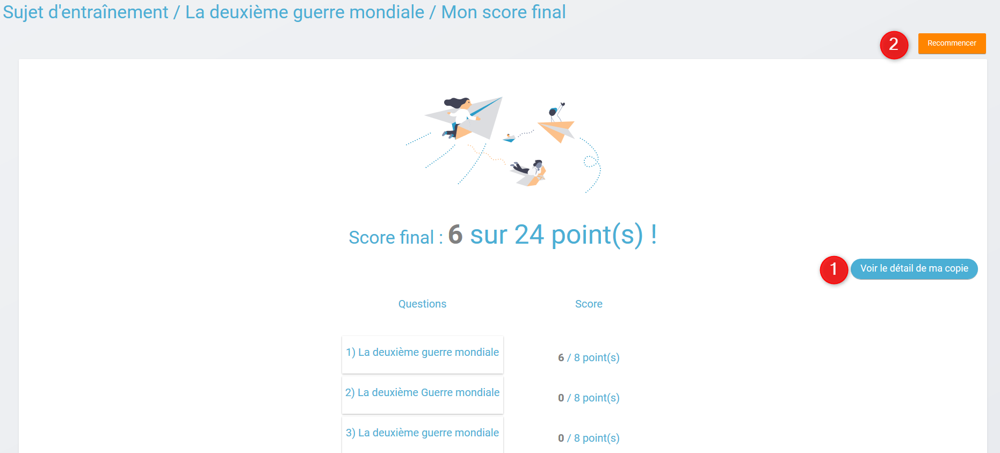

## Enseignant - Créer un nouveau sujet

Depuis la page d’accueil, cliquez sur « Mes applis » en haut à droite de l’écran puis cliquez sur « Exercices et évaluations ».

Pour créer un nouveau sujet, cliquez sur le bouton « nouveau sujet » dans la page d’accueil de l’appli.

Vous pouvez choisir de créer un sujet à rendre \(1\) ou un sujet interactif \(2\) :

* Sujet à rendre \(1\) : permet de programmer une remise de devoir sous forme de fichier et de suivre le rendu des élèves
* Sujet interactif \(2\) : permet de construire une évaluation en créant des questions qui seront corrigés manuellement et/ou automatiquement

Pour **un sujet à rendre**, saisissez un titre \(1\), ajoutez une consigne du sujet \(2\), puis vous pouvez distribuer le sujet \(3\).

Pour **un sujet interactif**, saisissez un titre \(1\) et ajoutez si vous le souhaitez une image d’illustration du sujet \(sinon c’est l’icône par défaut qui est affichée\) \(2\). Vous pouvez ajouter une description \(3\).

Cliquez enfin sur « Enregistrer » \(4\)

Pour ajouter du contenu à votre sujet, cliquez sur « ajouter un élément » :

Pour sélectionner le type de contenu à ajouter, cliquez sur « Enoncé » ou « Question ».

Si vous avez sélectionné l’outil question, vous pouvez choisir le type de question en cliquant sur l’une de ces icônes.

1. **Réponse simple**: l’apprenant doit saisir une réponse unique.
2. **Réponse ouverte**: l’apprenant doit saisir librement la réponse \(expression écrite\).
3. **Réponses multiples**: l’apprenant doit saisir les réponses possibles.
4. **QCM**: l’apprenant doit cocher la ou les bonnes réponses parmi celles proposées.
5. **Association**: l’apprenant doit relier différentes réponses entre elles.
6. **Mise en ordre**: l’apprenant doit classer les réponses proposées dans le bon ordre.
7. **Texte à trous**: l’apprenant doit compléter le texte à trous selon l’une des trois options \(saisie libre, liste déroulante, glisser déposer les réponses\).
8. **Zone à remplir \(textes\)**: l’apprenant doit saisir la réponse ou glisser-déposer la réponse à l’endroit prévu sur l’image de fond ou sélectionner la réponse dans la liste déroulante.
9. **Zone à remplir \(images\)**: l’apprenant doit glisser-déposer les images à l’endroit prévu sur l’image de fond.

Il vous suffit ensuite de compléter les champs de la question en renseignant :

1. Le titre
2. Le nombre de points attribués à la question
3. L’énoncé à l’aide de l’éditeur de texte
4. La ou les réponse\(s\)
5. L’explication de la réponse \(fourni à l'apprenant après correction du sujet\)
6. L’aide à la réponse \(fourni à l'apprenant lors de la réalisation du sujet\)

Pour certains types de question avec plusieurs possibilités de réponses \("Réponses multiples", "QCM", "Association" et "Mise en ordre"\), une case à cocher **"Erreur non autorisée"** s'affiche lors de la rédaction de la question. En sélectionnant cette option, cela signifie que l'apprenant devra trouver la totalité de la réponse et ne sera pas autorisé à trouver partiellement la réponse à la question. Par exemple : pour une question incluant deux bonnes réponses à trouver, si l'apprenant n'en trouve qu'une sur les deux, alors aucun point ne lui sera accordé.

Après avoir créé votre question, cliquez sur « ajouter un élément » et choisissez le type de la question suivante pour poursuivre votre sujet. En cochant la case à gauche du titre de la question, un bandeau orange en bas de votre écran s’affiche. Vous pouvez « dupliquer » ou « supprimer » la question.

Le volet à gauche de l’écran vous permet de glisser et de déposer des questions avec votre curseur pour les ordonner.

Il est possible de visualiser votre sujet en cliquant sur l’icône « aperçu » en haut à droite de votre écran.

## Enseignant - Distribuer un sujet interactif

Une fois la création de votre sujet terminée, vous pouvez le distribuer en cliquant sur l’icône en haut à gauche de votre écran.

Vous pouvez distribuer un sujet de manière classique, qui sera corrigé par l'enseignant et noté, ou un sujet d'entraînement, afin que les élèves puissent s'exercer sur un sujet. 

**Distribution classique**

Saisissez les premières lettres du nom de l’utilisateur ou du groupe d’utilisateurs que vous recherchez puis sélectionnez le nom de l’utilisateur ou du groupe. Lorsque vous ajoutez un groupe, la liste des utilisateurs individuels se met à jour dans la colonne de droite. Si vous souhaitez exclure un ou plusieurs élèves d’une distribution à un groupe, supprimez les utilisateurs individuellement. Cliquer ensuite sur le bouton « suivant ».

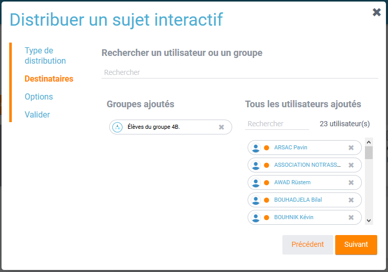

Vous pouvez accéder à la fiche de l'utilisateur en cliquant sur son nom :

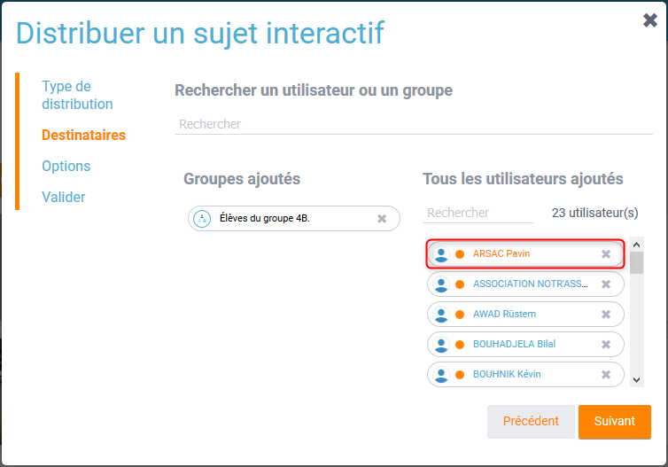

Vous pouvez également retrouver vos favoris dans la recherche d'utilisateur :

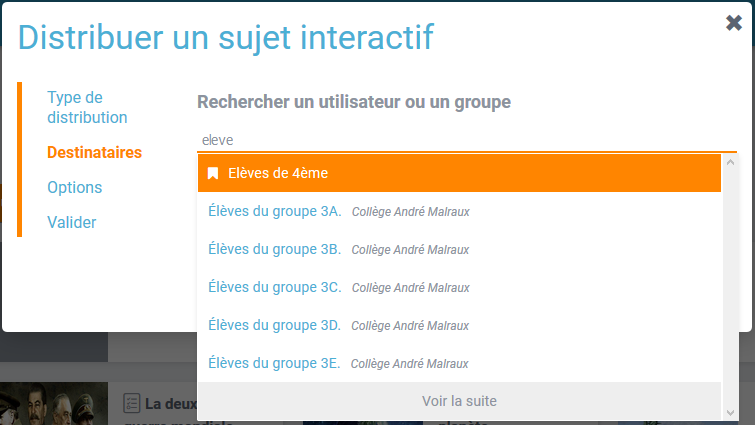

Les options de distribution s’affichent dans la fenêtre ci-dessous. Ces options vous permette de :

* \(1\) Renseigner les dates de début et de fin de distribution
* \(2\) Autoriser l'élève à modifier sa copie après l'avoir rendu : l’élève aura la possibilité de revenir sur sa copie après la remise, dans la limite du délai imparti et de la correction par l’enseignant
* \(3\) Afficher les questions dans un ordre aléatoire pour que chaque élève reçoive un sujet au format unique
* \(4\) Interdire la récupération du sujet par l'élève pour un mode entraînement
* \(5\) Indiquer un temps de réalisation du sujet \(délai uniquement indicatif\)

**Distribution entraînement**

Vous avez la possibilité de distribuer des sujets d’entraînements, que les élèves pourront refaire à volonté. Pour cela, choisissez le type de distribution « Distribution entraînement ».

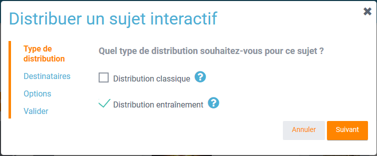

Ensuite, comme dans une distribution classique, vous pouvez choisir les destinataires. En revanche, les options sont plus limités qu'un sujet distribué de manière classique. Vous avez la possibilité de présenter les questions de manières aléatoires \(1\) et d'indiquer un temps de réalisation du sujet \(2\).

## Enseignant - Modifier la période de distribution d’un sujet

Afin de modifier la période de distribution d’un sujet déjà lancé, rendez-vous sur l’onglet "Mes corrections" \(1\), puis sélectionnez le sujet souhaité \(2\).

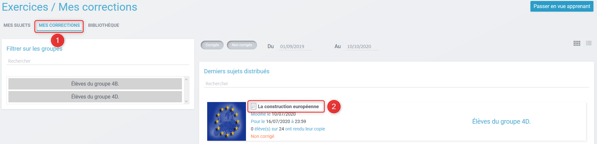

Dans le bloc des informations sur le sujet en haut à gauche, cliquer sur “Modifier”. Renseignez les nouvelles dates et heures de distribution et validez. Vous avez aussi la possibilité d'interdire aux élève de reprendre le sujet pour un entraînement. Si des élèves ont déjà commencé l'exercice, vous ne pourrez plus modifier la date de début de l’évaluation. Une notification sera envoyée à tous les apprenants pour les informer de la nouvelle date de fin de distribution.

## Enseignant - Déprogrammer un sujet distribué

Cliquez sur l’onglet “Mes Corrections” \(1\), puis cliquez sur le sujet souhaité \(2\).

Dans le bloc des informations sur le sujet en haut à gauche, cliquer sur “Déprogrammer” \(1\) Les apprenants n’auront plus accès au sujet et l'enseignant n'aura plus accès aux corrections.

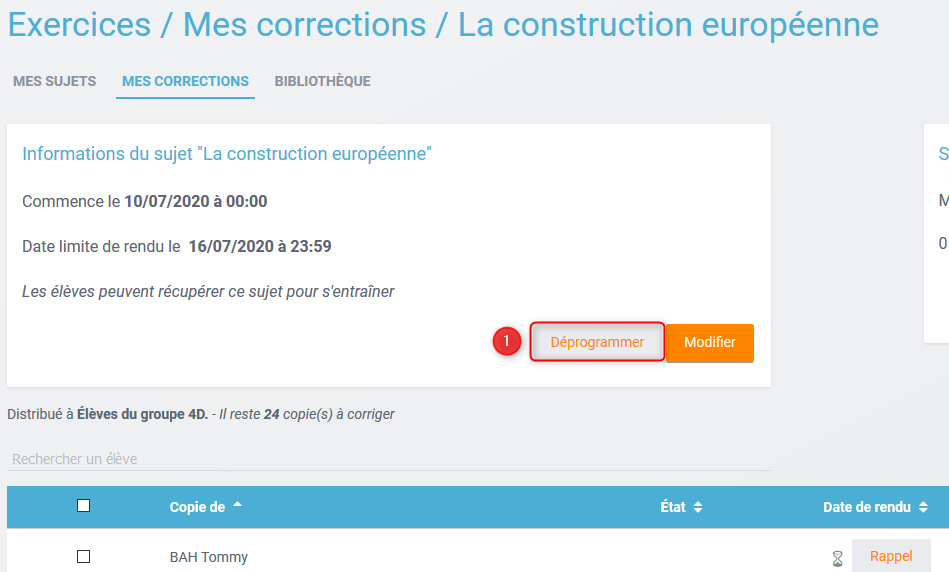

## Enseignant - Exclure un élève d’une évaluation distribuée à un groupe

Vous pouvez exclure un ou plusieurs élèves à la distribution. Pour cela, il vous suffit de sélectionner le groupe souhaité, et supprimer le ou les élève\(s\) à exclure dans la liste “utilisateurs ajoutés” \(1\)

Si vous avez déjà distribué le sujet, rendez-vous dans “Mes Corrections”. Sélectionnez le sujet souhaité puis cliquez sur le ou les élèves à exclure \(1\). Cliquez ensuite sur “Exclure de l’évaluation” dans le menu en bas de l’écran \(2\).

## Enseignant - Ajouter le statut "rendu" à un sujet

Un élève choisit de rendre son devoir directement auprès de l'enseignant, de main à main plutôt que par voie numérique...Vous êtes en mesure d'ajouter cette information dans votre espace "correction" pour les élèves concernés.

Cette option vous permettra notamment de ne pas inclure ces élèves dans les rappels automatiques de sujets non-rendus.

## Enseignant - Partager un sujet

Pour partager un sujet avec d’autres utilisateurs, cliquez sur la case à cocher correspondant au sujet \(1\) puis sur le bouton « Partager » \(2\).

La fenêtre de partage apparaît. Pour attribuer des droits d’accès à votre sujet à d’autres utilisateurs, suivez les étapes suivantes :

1. Saisissez les premières lettres du nom de l’utilisateur ou du groupe d’utilisateurs que vous recherchez.
2. Sélectionnez le nom de l’utilisateur ou du groupe.
3. Cochez les cases correspondant aux droits que vous souhaitez leur attribuer.

Vous pouvez attribuer différents droits aux autres utilisateurs de l’ENT :

* Consulter : l’utilisateur peut consulter le sujet.
* Contribuer : l’utilisateur peut modifier le sujet et le distribuer.
* Gérer : l’utilisateur peut modifier, partager, distribuer ou supprimer des sujets.

La personne à qui vous avez partagé le sujet peut le retrouver dans la rubrique « Sujets partagés avec moi ». En fonction des droits accordés, elle a la possibilité de le modifier et de le distribuer en cliquant sur l’intitulé du sujet.

Elle peut aussi copier le sujet en cochant la case en bas à droite du sujet et faire des modifications dans sa propre version.

_Nota Bene : Contrairement à la publication de sujet dans la bibliothèque \(cf. onglet dédié\) cette fonction de partage est restreinte aux seules personnes à qui les droits de consultation, contribution et/ou gestion ont été ouverts._

## Enseignant - Corriger un sujet

Pour corriger un sujet, cliquez sur l’onglet « Mes corrections » en haut à gauche de l’écran puis cliquez sur le sujet que vous souhaitez corriger.

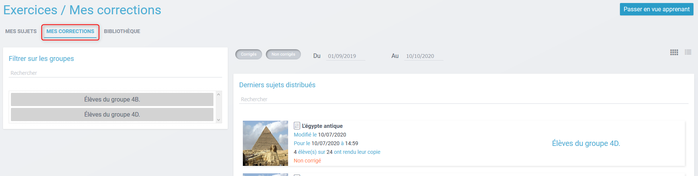

Vous arrivez sur la liste des élèves du groupe auquel vous avez distribué le sujet. Pour les élèves n'ayant pas rendu leur devoir, vous pouvez sélectionner un des élèves sur la case à cocher \(1\) afin de lui envoyer un rappel \(2\) pour faire le devoir, ou l'exclure de l'évaluation \(3\) si l'élève ne peut pas faire le devoir. Il est également possible de sélectionner en lot tous les élèves n'ayant pas rendu le devoir \(4\).

Cliquez sur le nom de l’élève \(1\) pour corriger la copie rendue par celui-ci. Vous pouvez cochez la case à gauche du nom de l’élève pour changer à la volée le statut d'une ou de plusieurs copies en "corrigé" \(2\).

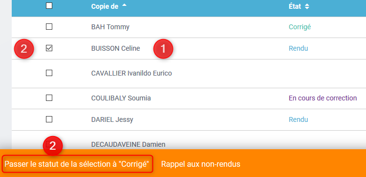

Vous disposez de plusieurs statuts de correction pour vous repérez au cours des corrections des devoirs.

* Corrigé \(1\) : le devoir a été corrigé et il sera disponible pour l'élève à partir de la date de rendu
* En cours de correction \(2\) : la correction a été débutée mais n'est pas finalisée
* Rendu \(3\) : le devoir a été rendu par l'élève mais la correction n'a pas encore débutée

## Enseignant - Dupliquer un sujet

Cliquez sur le sujet dont vous souhaitez faire une copie, puis choisissez l'option "dupliquer" sur le menu.

Vous verrez apparaître un message vous demandant de patienter un moment, puis un deuxième message vous signalant que la copie a été correctement réalisée.

Vous pourrez ensuite vérifier que la copie est bien présente dans votre application.

## Enseignant - Publier dans la Bibliothèque

La Bibliothèque est un espace de partage et d’inspiration entre enseignants.

Si vous souhaitez publier votre sujet dans la Bibliothèque pour inspirer d’autres enseignants, il vous suffit de cliquer sur le contenu concerné et de cocher la case en bas à droite du contenu que vous voulez publier. Le bandeau orange en bas de l’écran s’affiche. Cliquez sur le bouton « Publier dans la Bibliothèque ».

Vous devez ensuite renseigner les caractéristiques de votre contenu pour expliquer votre usage :

* Titre : le plus explicatif possible
* Vignette : carrée au format JPG ou PNG
* Description et contexte pédagogique : Décrivez l’activité, son contexte, vos intentions pédagogiques, les résultats obtenus… Dites-nous tout ! 
* Type d’activité : activité en classe, à la maison, individuelle, en groupe ? 
* Discipline : Quelle est la discipline concernée par l’activité
* Langue : Dans quelle langue est l’activité ? 
* Âge des élèves : Quel est la tranche d’âge des élèves concernés par l’activité ? 
* Mots-clés : Quels sont les mots-clés qui caractérisent le mieux votre activité ?  

Lorsque votre sujet est publié, vous pouvez le visualiser en cliquant sur “Voir dans la Bibliothèque”.

Vous aurez ensuite la possibilité de modifier les champs saisis ou de supprimer la publication de votre sujet en cliquant sur “Modifier” depuis la page de votre activité.

## Enseignant - Consulter les statistiques d’un sujet

Vous pouvez consulter les statistiques de vos sujets. Pour cela, rendez-vous sur l’onglet “Mes Corrections” \(1\) puis cliquez sur le sujet souhaité \(2\).

Un encart en haut à droite vous donne les statistiques générales du sujet \(1\). En cliquant sur “Plus de Stats”, vous accédez aux statistiques détaillées du sujet \(2\).

Vous accédez ainsi :

* Aux résultats par question par élève
* A la moyenne par question
* A la moyenne générale du sujet \(score automatique et score final\)

## Enseignant - Exporter les données de mes sujets

Une fois réceptionné et effectué toutes les corrections de vos élèves, vous allez pouvoir récupérer certaines données dans un fichier CSV depuis la page de Statistiques.

Vous allez pouvoir exporter toutes les notes de vos élèves pour un sujet donné et/ou exporter leurs réponses.

## Enseignant - Importer un sujet

Il vous est possible d’importer des sujets. Depuis la page mes sujets, cliquez sur l’icône des options, représentée par une petite roue, à droite de l’onglet "Nouveau sujet". Puis sélectionnez "Importer un sujet"

Vous accéderez à une note d’information concernant les fichier autorisé depuis Moodle et depuis TD Base :

Charger le sujet au format Moodle XML. Renseignez le titre de votre sujet, une image et une description si nécessaire. Afin de valider, cliquez sur "Importer".

## Enseignant - Exporter un sujet

Il vous est possible d’exporter des sujets. Dans “Mes Sujets”, sélectionnez un sujet interactif \(1\), puis cliquer sur “Exporter” \(2\).

