# Carnet d'activités

Devenez un maître de l'organisation avec l'appli **Carnet d'activités** ! Créez et organisez les activités de la classe comme vous le souhaitez !

## Présentation

Il est facile de publier les leçons des élèves dans le carnet d'activités. Les élèves y accèdent jour par jour et disposent également d'une synthèse de la semaine (vue semaine). Le cahier peut être partagé avec un utilisateur ou un groupe d'utilisateurs, selon les souhaits de l'enseignant.

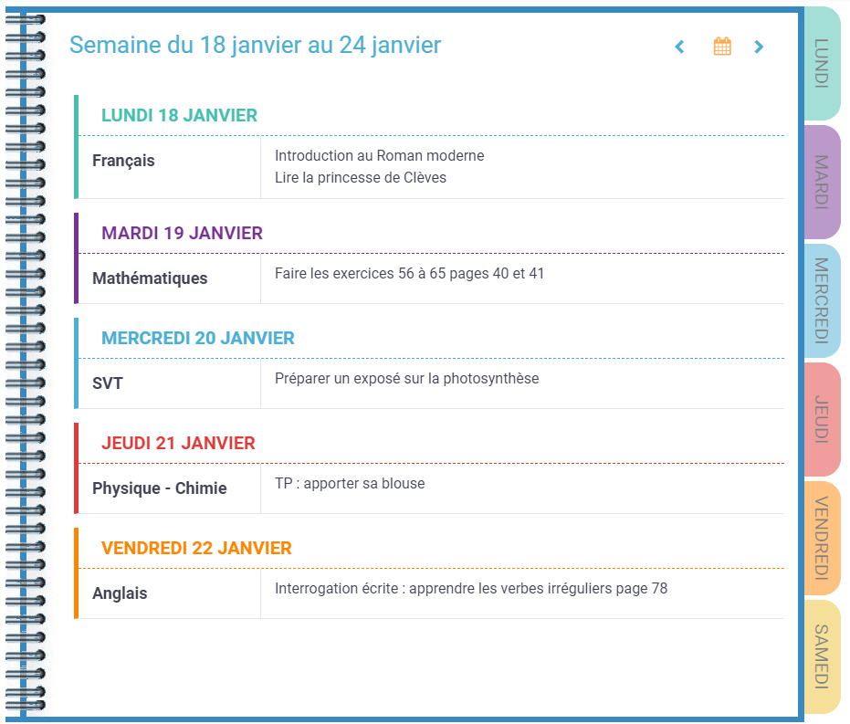

## Créer un carnet d'activités

Pour accéder à l'appli Carnet d'activités, cliquez sur l'icône correspondante dans la page « Mes applis ».

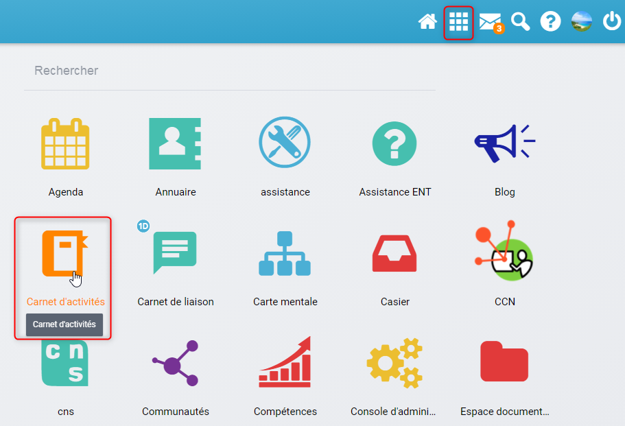

Pour créer un nouveau carnet d'activités, cliquez sur le bouton « Créer » en haut de la page.

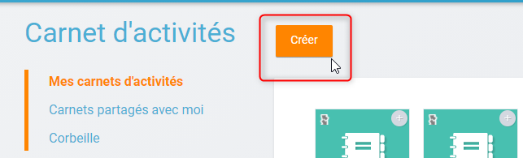

Votre cahier est désormais créé mais n'est pas encore visible. Il vous faut maintenant le partager avec les élèves et les parents du groupe classe auquel il est destiné.

## Partager un carnet d'activités

Pour partager un carnet d'activités avec d'autres utilisateurs, cliquez sur le signe + (1) située sur le coin en haut à droite de l\\'icône du cahier puis sur « Partager » (2).

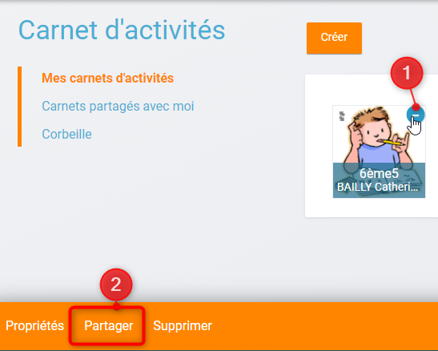

Dans la fenêtre de partage, vous pouvez donner des droits de lecture, de contribution et de gestion à d'autres personnes sur votre cahier. Pour cela, saisissez les premières lettres du nom de l'utilisateur ou du groupe d'utilisateurs que vous recherchez (1), sélectionnez le résultat (2) et cochez les cases correspondant aux droits que vous souhaitez leur attribuer (3). Pour valider, cliquez sur \\"Partager\\" (4).

Les différents droits que vous pouvez attribuer sont les suivants :

* Lecture : l'utilisateur visualise le carnet d'activités
* Contribution : l'utilisateur peut créer des activités dans le carnet d'activités
* Gestion : l'utilisateur peut partager, modifier et supprimer le carnet d'activités

Votre carnet d'activités est créé et partagé, vous pouvez désormais renseigner les premières activités !

## Créer une activité

Une fois votre carnet d'activités créé, vous pouvez y ajouter des activités. Pour cela, cliquez sur le titre ou sur l\\'image du cahier dans le dossier correspondant.

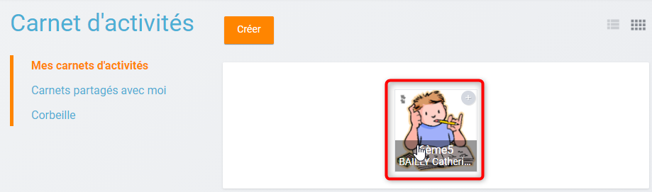

La semaine en cours est affichée par défaut. Pour saisir une activité pour une semaine ultérieure, vous pouvez soit faire défiler les semaines en cliquant sur les flèches (1) soit sélectionner la date dans le calendrier (2).

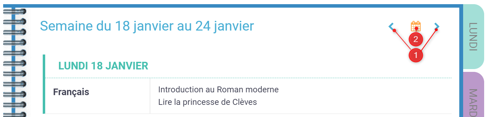

Cliquez ensuite sur un jour de la semaine pour saisir une nouvelle activité.

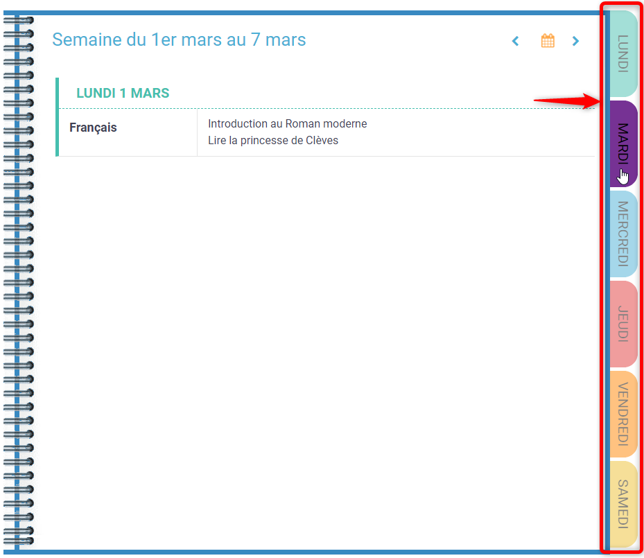

Une fois le jour sélectionné, cliquez sur le bouton « Créer ».

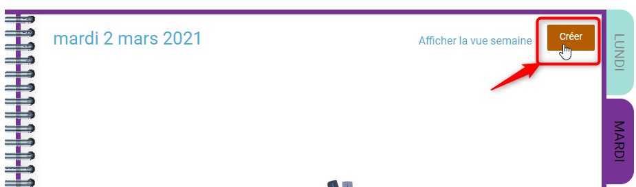

Vous pouvez ajouter une activité dans le cahier. Tout d'abord, cliquez sur la colonne de gauche pour ajouter la matière. (1)

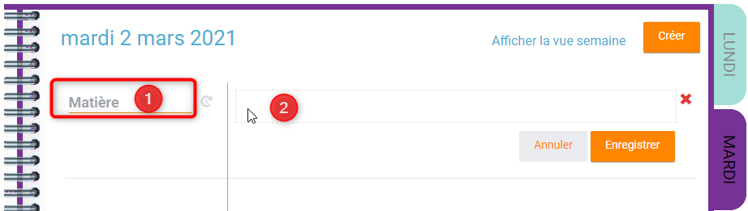

Cliquez dans la colonne principale pour afficher l'éditeur de texte (2).

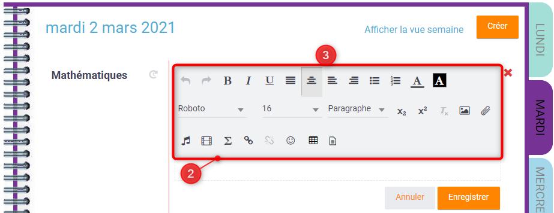

Une barre d'outils apparait au-dessus de votre zone de saisie (3) Comme pour les autres services, vous pouvez intégrer plusieurs types de contenus dans l'activité : texte, image, lecteur audio, lecteur vidéo, formule mathématique...

Une fois vos contenus saisis. Cliquer sur le bouton ENREGISTRER en bas à droite de la zone de saisie pour enregistrer les données (4). En cliquant sur ANNULER, vos ajouts ou modifications ne seront pas prises en compte.

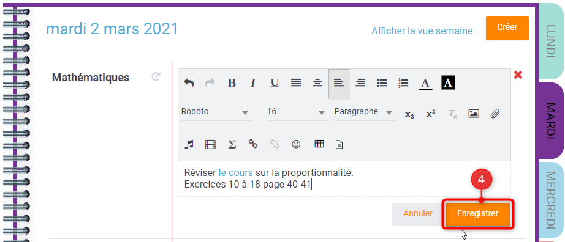

Pour **modifier** votre activité, il suffit de recliquer sur la zone de saisie, y faire vos modifications et les enregistrer.

## Ajouter une récurrence

Si vous souhaitez que l\\'activité créé soit **récurrente** :

1. Après avoir enregistré votre activité, cliquez sur l\\'icône de récurrence à droite de la matière
2. Renseignez la fréquence (hebdomadaire ou quinzomadaire), le jour de répétition, et la durée de répétition de l\\'activité
3. Cliquez sur le bouton \\"Valider\\"

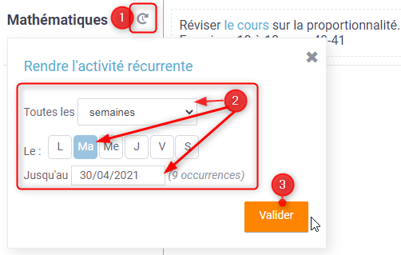

Lorsque vous modifiez la récurrence sur une de ses occurrences, vous la modifiez pour les évènements à venir par rapport à cette occurrence.

Lorsque vous supprimez la récurrence sur une de ses occurrences, vous supprimez la récurrence de l\\'activité pour toute les dates sauf l\\'occurrence sur laquelle vous faite la modification.

Une fois que vous avez terminé, cliquez sur le bouton « Afficher la vue semaine » pour revenir à la page d'accueil du cahier.

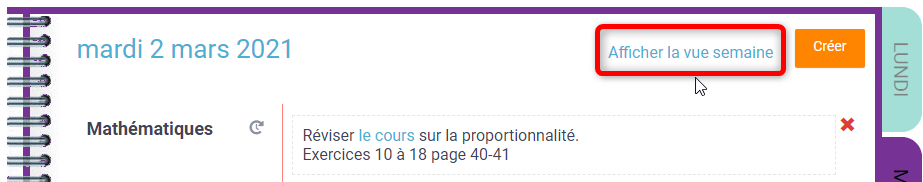

## Préconisations d'usages

_Au sein de l’établissement, nous recommandons à la direction de créer un carnet d’activités par groupe classe (et non par matière). Pour s’y retrouver facilement, pensez à bien nommer chaque carnet d’activités. Par exemple : « Classe de xxx, groupe x ». Il est important ensuite de partager chaque cahier en contribution avec les enseignants du groupe classe concerné pour qu’ils puissent tous éditer les activités. Et d’associer les élèves et parents du groupe classe au partage, avec des droits de lecture, pour qu’ils puissent consulter le cahier et soient notifiés à chaque nouvelle édition._
