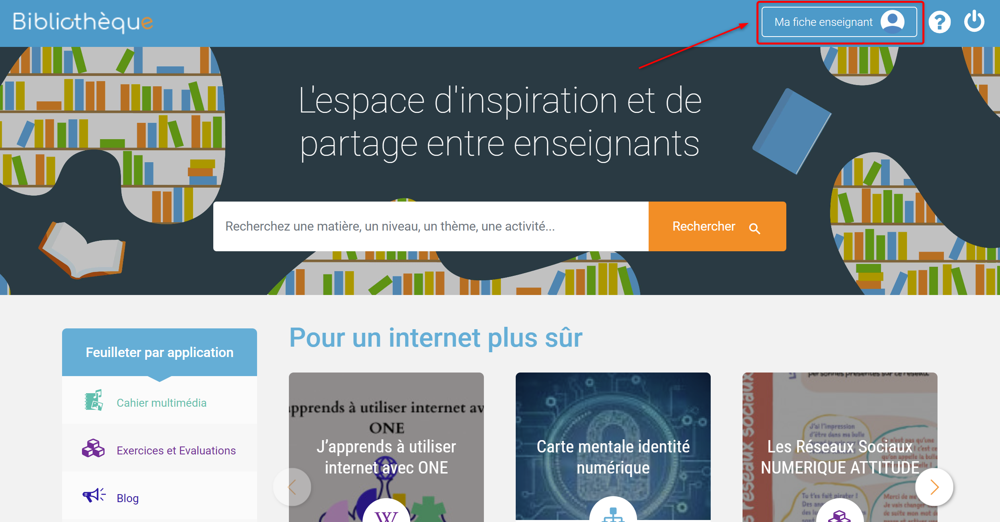
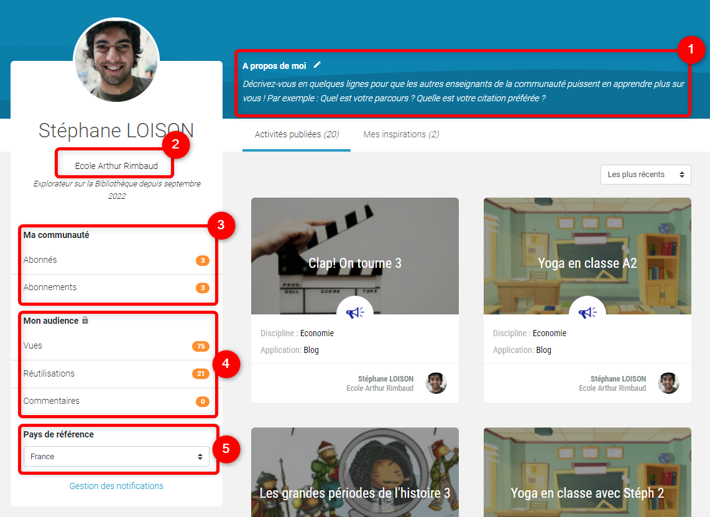
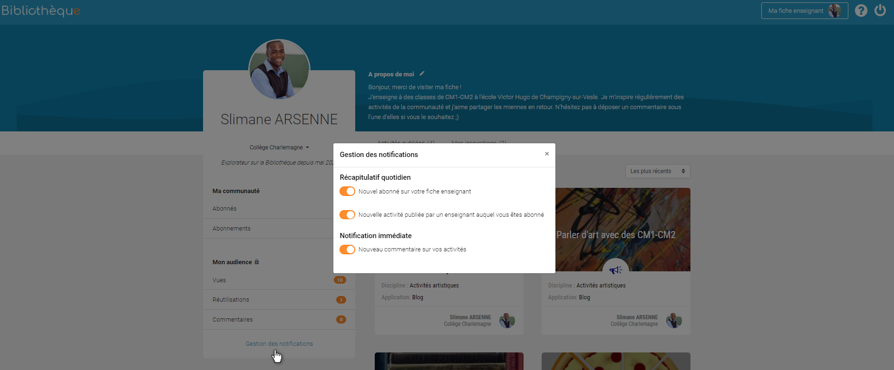
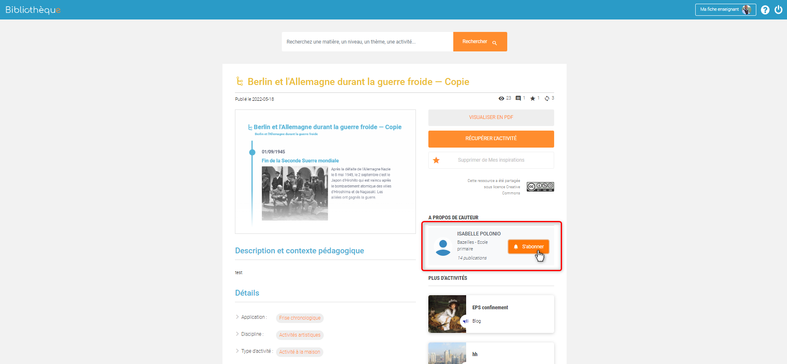
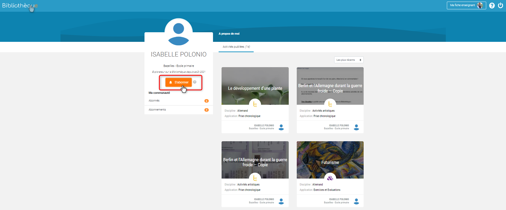
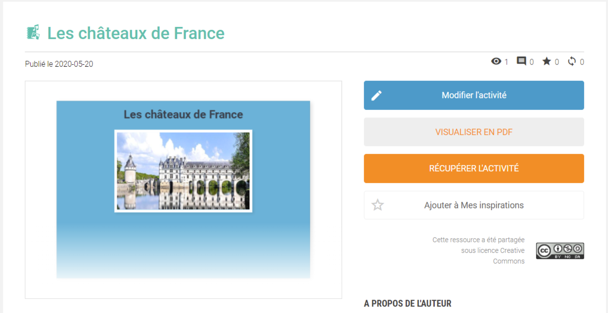
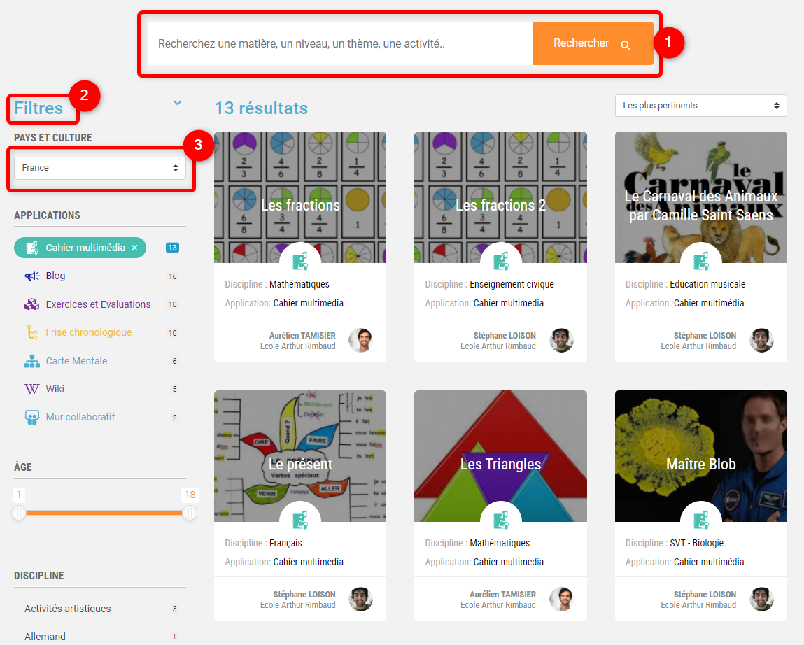
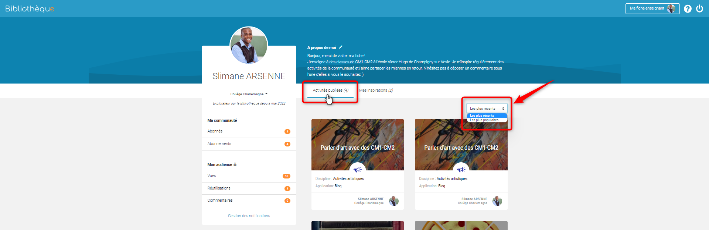
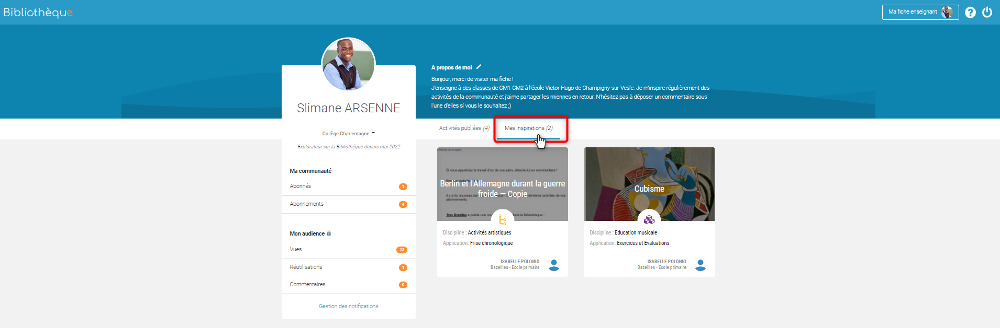

# Bibliothèque

Bienvenue sur la Bibliothèque, l’espace réservé aux enseignants pour mutualiser vos activités et ressources pédagogiques numériques !

## Présentation

Vous avez créé un super parcours à l’aide d’une Frise chronologique ? À contrario, vous cherchez un Cahier multimédia prêt-à-l’emploi pour votre prochain cours de maths ? Rendez-vous dans la Bibliothèque ! Partagez et valorisez vos productions réalisées avec vos applications pédagogiques, récupérez des contenus proposés par d’autres enseignants et échangez sur vos activités avec la grande communauté des enseignants de votre espace collaboratif.

Cette bibliothèque est internationale, c'est à dire qu'elle est :

* Ouverte à des enseignants mexicains et espagnols qui peuvent ajouter du contenu.
* En France, les enseignants peuvent retrouver du contenu de ces pays.
* Les utilisateurs de la bibliothèque choisissent lors de leur première connexion à la bibliothèque un pays/une culture de référence.

En plus des activités que nous proposons "A la une", vous verrez également sur la page d’accueil de la Bibliothèque :

1. Le bandeau Mes abonnements, qui affiche les activités des enseignants auxquels vous êtes abonné.e.
2. Le bandeau Les plus récents qui présente les activités les plus récentes du mois.
3. Le bandeau Les plus populaires ce mois-ci qui affiche les activités les plus vues, réutilisées ou commentées du mois.

  
Pour trouver d'autres activités, utilisez la barre de recherche et les filtres qui se trouvent sur la gauche de votre écran.

## Consulter et modifier sa fiche enseignant ##

Dans la page d'accueil de la bibliothèque, en haut à droite, vous trouverez la fiche enseignant.

**Consulter et modifier sa fiche enseignant**

Chaque enseignant possède une fiche de présentation dans l’application.

Sur cette fiche, vous pouvez :

1. Ajouter quelques lignes pour décrire votre parcours ou vos aspirations, en cliquant sur **A propos de moi**.
2. Modifier **l’établissement d’affichage** si vous intervenez dans plusieurs écoles.
3. Voir le **nombre des abonné.es** (enseignants qui vous suivent) et des **abonnements** (enseignants que vous suivez).
4. Accéder aux **données d’audience** de vos contenus (vues, réutilisations, commentaires) si vous avez publié des activités dans la Bibliothèque.
5. Modifier le **pays de référence**. La mise à jour de cette valeur mettra également à jour les tags des activités de l’utilisateur.

**Gérer ses notifications**

Vous pouvez gérer vos notifications en cliquant sur **Gestion des notifications**.

Dans cette fonctionnalité, vous pouvez **activer ou désactiver** la réception des notifications pour :

* Un nouvel abonné sur votre fiche enseignant.

* Une nouvelle activité publiée par un enseignant auquel vous êtes abonné.

* Un nouveau commentaire sur vos activités.

## S'abonner à un enseignant ##

Dans la bibliothèque, chaque enseignant peut s’abonner à un autre enseignant pour être averti de la publication des dernières contributions de ce dernier. Si vous repérez une activité inspirante et souhaitez suivre son auteur, il vous suffit, dans la fiche de l’activité, dans la section "A propos de l'auteur", de cliquer sur **S’abonner**.

Vous pouvez aussi vous abonner depuis la fiche de présentation de l’enseignant.

## Publier dans la Bibliothèque

Pour inspirer d'autres enseignants, vous pouvez publier dans la Bibliothèque depuis les applications suivantes :

* Blog
* Cahier Multimédia
* Wiki
* Exercices
* Mur collaboratif
* Carte mentale 
* Frise chronologique

Pour cela, sélectionnez la ressource souhaitée, et cliquez sur “Publier dans la Bibliothèque” dans le menu en bas de page.

Lorsque votre activité est publiée, vous pouvez la visualiser en cliquant sur Voir dans la Bibliothèque.

Vous aurez ensuite la possibilité de modifier les champs saisis ou de supprimer la publication de votre activité en cliquant sur Modifier depuis la page de votre activité.

## Rechercher et consulter une activité dans la Bibliothèque

**Rechercher une activité**

Pour trouver l'activité qui correspond à vos besoins, vous pouvez utiliser :

* La barre de recherche pour y taper des mots clés.
* Les filtres pour restreindre les résultats de recherche en fonction de certains critères de votre choix.
* Le filtre pays et culture pour accéder aux activités selon le pays associé (par défaut, le pays de référence de l'utilisateur).

**Consulter une activité**

En cliquant sur la page d’une activité depuis la page d’accueil de la Bibliothèque ou un résultat de recherche, vous pouvez :

1. Voir les **statistiques** d’une activité :

    A. Nombre de consultations de l’activité (hors consultations de l’auteur sur sa propre activité)

    B. Nombre de commentaires laissés sur l’activité

    C. Nombre d’ajouts dans Mes Inspirations

    D. Nombre de récupération par d’autres enseignants

2. Visualiser l'activité en **PDF**.

3. **Ajouter une activité** à Mes inspirations pour l’enregistrer et la consulter plus tard depuis votre                collection, disponible dans le bandeau supérieur.

Vous pouvez également commenter une activité ou répondre à un commentaire existant en bas de page de chaque activité. L’auteur de l’activité sera notifié de ce commentaire et pourra vous répondre !

## Récupérer une activité de la Bibliothèque dans mes applis

En cliquant sur **Récupérer l’activité**, l’activité sera importée dans votre application correspondante. Vous pourrez la réutiliser pour constituer votre propre activité et la partager avec vos élèves ! Vous pouvez ensuite être redirigé vers l’activité dans votre application en cliquant sur **Voir l’activité**.

## Retrouver mes publications et mes inspirations

Pour retrouver les activités que vous avez publiées et les activités enregistrées comme inspiration, rendez-vous dans **Ma fiche enseignant**, dans le bandeau supérieur.

**Retrouver mes publicaions**

Retrouvez les activités que vous avez publiées en cliquant sur **Activités publiées**. Vous pouvez les filtrer en fonction des plus récents ou des plus populaires.

**Retrouver mes inspirations**

## Supprimer une activité publiée dans la Bibliothèque

Toute activité publiée dans la Bibliothèque peut être supprimée par son auteur. Pour cela, rendez-vous dans “Ma fiche enseignant”, puis **Activités publiées**.

Une fois sur votre activité :
1. Cliquez sur le bouton **Modifier**
2. Cliquez sur le bouton **Supprimer l’activité**. Les statistiques de l’activité ainsi que les commentaires associés seront supprimés.

## Signaler un contenu inapproprié

Un problème sur une activité, un commentaire? Vous pouvez signaler un contenu inapproprié à tout moment en cliquant sur **Signaler un contenu inapproprié** en bas de page.

Vous serez ensuite invité à renseigner les raisons de ce signalement avant de valider. Votre signalement sera ensuite traité dans les plus brefs délais.

