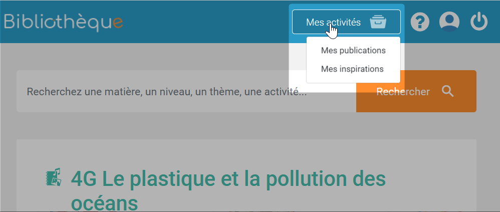

# Bibliothèque

Bienvenue _s_ur la Bibliothèque, l’espace réservé aux enseignants pour mutualiser vos activités et ressources pédagogiques numériques !

## Présentation

Vous avez créé un super parcours à l’aide d’une Frise chronologique ? À contrario, vous cherchez un Cahier multimédia prêt-à-l’emploi pour votre prochain cours de maths ? Rendez-vous dans la Bibliothèque ! Partagez et valorisez vos productions réalisées avec vos applications pédagogiques, récupérez des contenus proposés par d’autres enseignants et échangez sur vos activités avec la grande communauté des enseignants de votre espace collaboratif.

## Publier dans la Bibliothèque

Vous pouvez publier dans la Bibliothèque depuis les applications suivantes :

* Blog
* Cahier Multimédia
* Wiki
* Exercices et évaluations
* Mur collaboratif
* Carte mentale 
* Frise chronologique

Pour cela, sélectionner la ressource souhaitée, et cliquez sur “Publier dans la Bibliothèque” dans le menu inférieur.

## Consulter une activité dans la Bibliothèque

Une activité est une production réalisée via les applications pédagogiques de votre plateforme. En cliquant sur la page d’une activité depuis la page d’accueil de la Bibliothèque ou un résultat de recherche, vous pouvez :

**A\) Visualiser en PDF**

Vous accédez au PDF de l’activité pour en obtenir un aperçu. Pour cela, cliquez sur “Voir en PDF”

**B\) Voir les statistiques d’une activité**

Vous accédez en haut à droite d’une activité aux différentes statistiques de consultation :

1. Nombre de consultations de l’activité \(hors consultations de l’auteur sur sa propre activité\) 
2. Nombre de commentaires laissés sur l’activité
3. Nombre d’ajouts dans Mes Inspirations
4. Nombre de récupération par d’autres enseignants 

**C\) Ajouter une activité à Mes inspirations**

Ajouter une activité dans Mes inspirations vous permet l’enregistrer pour la consulter plus tard depuis votre Collection, disponible dans le bandeau supérieur.

**D\) Commenter une activité**

Vous pouvez commenter une activité, ou répondre à un commentaire existant, en bas de la page de chaque activité. L’auteur de l’activité sera notifié de ce commentaire et pourra vous répondre !

## Récupérer une activité de la Bibliothèque dans mes applis

En cliquant sur “Récupérer l’activité”, l’activité sera importée dans votre application correspondante. Vous pourrez la réutiliser pour constituer votre propre activité et la partager avec vos élèves ! Vous pouvez ensuite être redirigé vers l’activité dans votre application en cliquant sur “Voir l’activité”.

## Retrouver mes publications et mes inspirations

Pour retrouver les activités que vous avez publiées et les activités enregistrées comme inspiration, rendez-vous dans "Mes activités", dans le bandeau supérieur.

## Modifier une activité publiée dans la Bibliothèque

Lorsque vous avez publié une activité dans la Bibliothèque, vous pouvez modifier les champs renseignés à tout moment \(titre, description et contexte pédagogique, mots-clés\).  
Pour cela, rendez-vous dans “Mes activités”, puis “Mes publications”. Une fois sur votre activité, cliquez sur le bouton “Modifier”.

## Supprimer une activité publiée dans la Bibliothèque

Toute activité publiée dans la Bibliothèque peut être supprimée par son auteur. Pour cela, rendez-vous dans “Ma Collection”, puis “Mes publications”. Une fois sur votre activité, cliquez sur le bouton “Modifier” puis “Supprimer l’activité”. Les statistiques de l’activité ainsi que les commentaires associés seront supprimés.

## Signaler un contenu inapproprié

Un problème sur une activité, un commentaire? Vous pouvez signaler un contenu inapproprié à tout moment en cliquant sur “Signaler un contenu inapproprié”.

Vous serez ensuite invité à renseigner les raisons de ce signalement avant de valider. Votre signalement sera ensuite traité dans les plus brefs délais.

