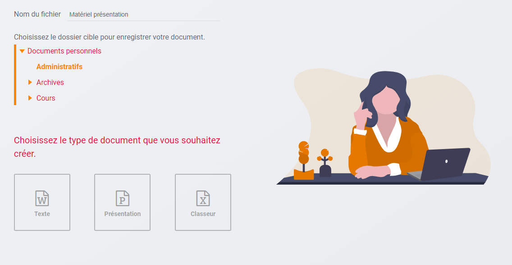
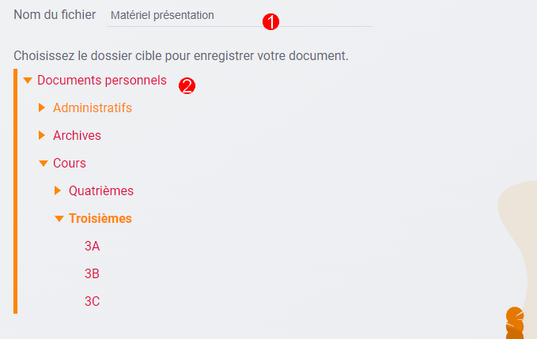
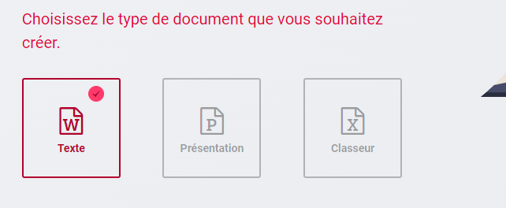

# Outils de bureautique

Créez vos documents textes, vos présentations et vos classeurs en ligne ! À
l’aide de l’application **Outils de bureautique**, créez vos documents et
enregistrez-les directement dans votre espace documentaire.

## Présentation

Outil de bureautique vous permet de créer vos documents et de les enregistrer
dans le dossier de votre choix, dans votre espace documentaire.

## Créer un document

1.  Saisir le nom de votre document

2.  Sélectionner le dossier où vous souhaitez l'enregistrer dans votre espace
    documentaire

Cliquer sur le type de document de votre choix pour le créer à l'emplacement
souhaité. Le document est créé dans le dossier sélectionné et s'ouvre
directement pour permettre la modification.

