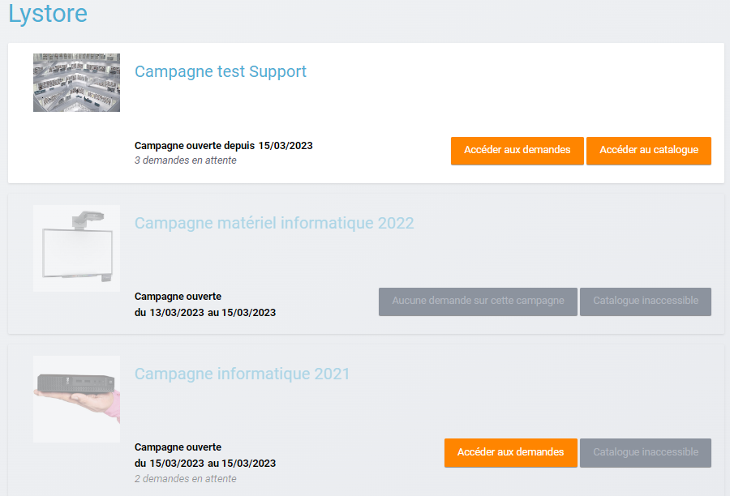
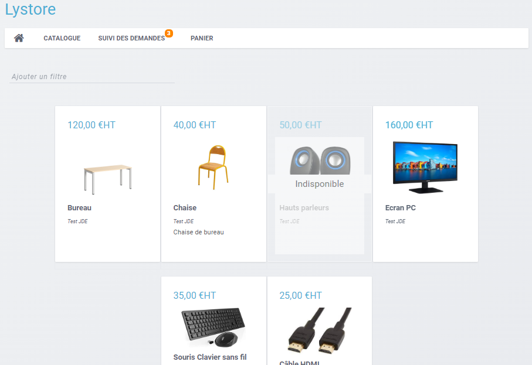
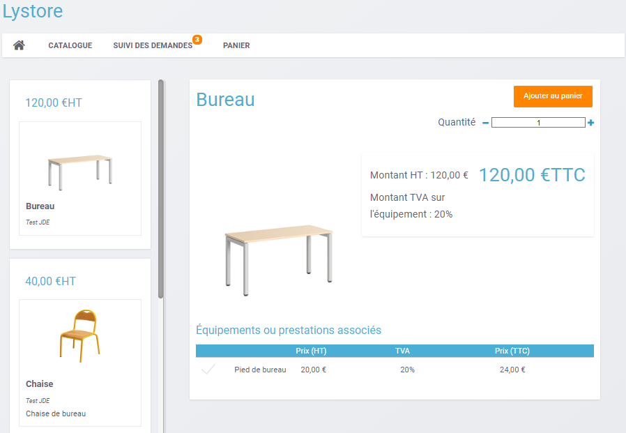
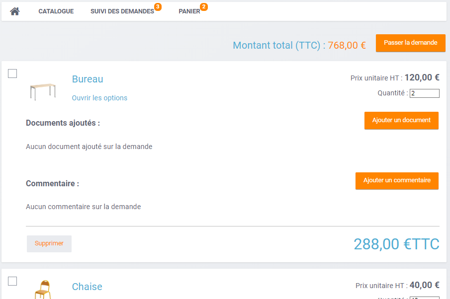
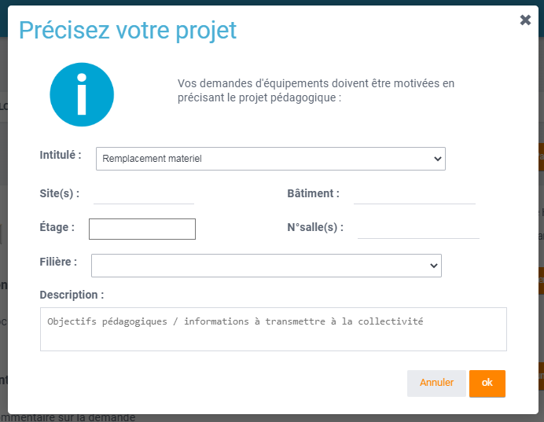
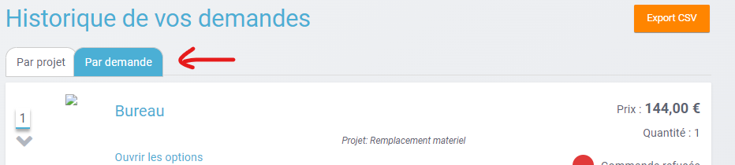
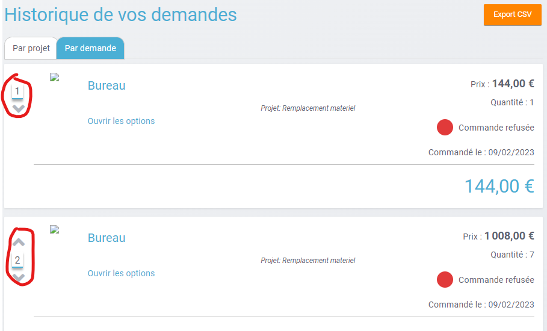

# Lystore

## Passer des commandes à votre collectivité
### 1. **Accéder à la campagne de matériel**

Si vous êtes en charge de passer des commandes de matériel dans votre établissement, vous arrivez sur une page d'accueil similaire à celle-ci lorsque vous accédez à l'application Lystore :

Sur cet écran, toutes les campagnes de commandes créées par votre collectivité y sont répertoriées. On y retrouve les anciennes campagnes, en gris, et les campagnes en cours, colorées.

Sur les campagnes ouvertes (ici, Campagne test Support), il y a 2 boutons utilisables :
- **Accéder aux demandes**, pour consulter l'historique de vos demandes faites sur cette campagne
- **Accéder au catalogue**, pour accéder au catalogue des ressources proposées dans cette campagne et pouvoir effectuer vos demandes.

### 2. **Accéder au catalogue**

**Pour passer une commande** à votre collectivité, cliquez sur le bouton **Accéder au catalogue** de la campagne souhaitée.
Vous accédez alors au catalogue proposé par la collectivité pour la campagne concernée, comme sur l'exemple ci-après :

### 3. **Sélectionner des équipements**

Sélectionnez un des équipements que vous souhaitez ajouter à votre panier. Puis, vous pouvez choisir la quantité voulue de cet équipement.

**Remarque** : Sur l'exemple ci-dessus on peut voir qu'il y a un équipement associé (pied de bureau) à l'équipement initialement choisi (le bureau). Cela signifie que la commande du bureau implique la commande du pied de bureau, mais il n'y a pas besoin d'ajouter manuellement le pied de bureau, il est directement associé au bureau.
Le prix total de l'article affiché en bleu à droite correspond donc au prix de l'article seul auquel s'ajoute le prix des éventuels équipements associés (s'il n'y a pas d'équipements associés, le prix reste le même).

Cliquez sur "Ajouter au panier" pour ajouter l'article en quantité voulue à votre panier.

### 4. **Consulter et valider votre panier**

Pour accéder à votre panier, cliquez sur l'onglet "Panier" dans le menu en haut de l'écran.

De là, vous avez plusieurs options :
- Modifier un équipement :
   - Modifier la quantité d'un équipement
   - Supprimer un équipement 
   - Ajouter un commentaire sur un équipement 
   - Joindre un document à un équipement 
- Passer une commande :
  - De tout le panier en cliquant directement sur le bouton "Passer la demande" alors qu'aucun équipement n'est coché 
  - D'équipements sélectionnés en cliquant aussi sur le bouton "Passer la demande" mais alors que les équipements voulus ont été sélectionnés. Cela permet de faire plusieurs commandes différentes pour des projets différents

Une fois le bouton "Passer la demande" cliqué, la pop-up suivante apparaît :

Elle permet de donner des précisions sur votre demande.
Vous devez obligatoirement choisir l'intitulé de votre demande (les intitulés sont choisis par votre collectivités). 
Les autres champs sont optionnels.

### 5. **Consulter vos demandes**

Aller dans l'onglet "Suivi des demandes" dans le menu en haut de l'écran.

Vous pouvez alors consulter l'historique de vos demandes pour la campagne choisie, selon 2 types de navigation :

- "Par demande" : toutes vos demandes, indépendamment des projets, y sont répertoriées. Vous pouvez alors prioriser vos demandes en utilisant les flèches en haut à gauche de chaque demande
  
- "Par projet" : toutes vos demandes y sont affichées, par projets

Sur chaque demande, un statut est affiché (à droite) pour vous indiquer l'état de vos demandes.

## Consulter l'historique de vos demandes
Depuis la page d'accueil de Lystore, cliquez sur le bouton "Accéder aux demandes" présent sur la campagne dont vous souhaitez consulter l'historique de vos demandes.

Vous accédez alors à l'historique de vos demandes pour la campagne choisie. Vous pouvez alors naviguer selon 2 types de navigation :

- "Par demande" : toutes vos demandes, indépendamment des projets, y sont répertoriées. Vous pouvez alors prioriser vos demandes en utilisant les flèches en haut à gauche de chaque demande
  
- "Par projet" : toutes vos demandes y sont affichées, par projets

Sur chaque demande, un statut est affiché (à droite) pour vous indiquer l'état de vos demandes.
