# Magneto

Que ce soit pour préparer des exposés ou des cours, quoi de mieux que de pouvoir agréger tout type de contenus sur un tableau ? Le principe est simple : sur un tableau blanc, ajouter des aimants contenant du contenu multimédia, texte, lien le tout de façon collaborative et en temps réel.

Ces tableaux Magnéto disposent d’une barre de création permettant l’ajout de différents types de contenus y compris du contenu en provenance d’autres tableaux. Une extension web permet également d’agréger du contenu directement pendant sa navigation.

## Créer un tableau

Depuis l'application Magnéto, il est possible de **créer des tableaux blancs depuis le bouton "Créer un tableau"** en haut à droite de la fenêtre.

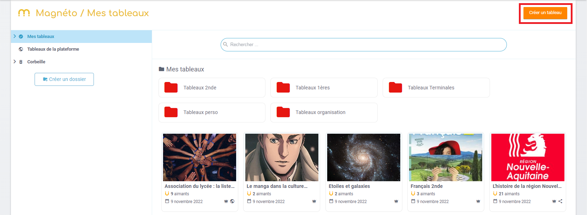

Une pop up s'ouvre alors. Il est **obligatoire de mettre un titre et une vignette**. La description est optionnelle.

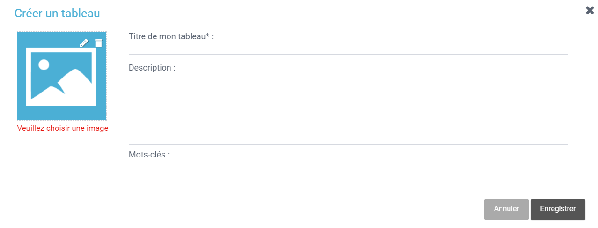

Au **clic sur "Enregistrer"**, le tableau se crée et l'utilisateur est directement redirigé vers le tableau vide sur lequel il pourra ajouter des aimants.

La collection de tableaux est alors disponible et il est possible de **créer des dossiers pour les ranger**.

Sur la carte des tableaux, des icônes indiquent si les tableaux sont :
* **partagés**  

* **partagés à la communauté**  

* **notre propriété**  

## Ajouter des aimants

L'utilisateur peut **ajouter des aimants sur son tableau à partir de la barre latérale**.
Il existe différents types d'aimants :
* texte

* image

* video

* son

* fichier

* lien

* aimants d'autres tableaux

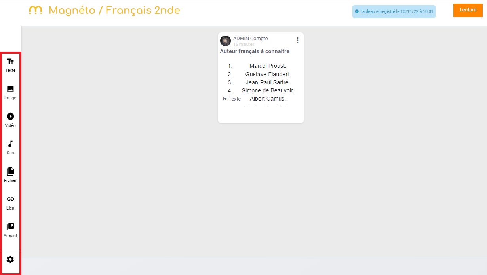

Au clic sur chaque type d'aimant, une **pop-up s'ouvre avec des données à sélectionner puis des informations à saisir**.

Exemple de création d'un aimant texte :

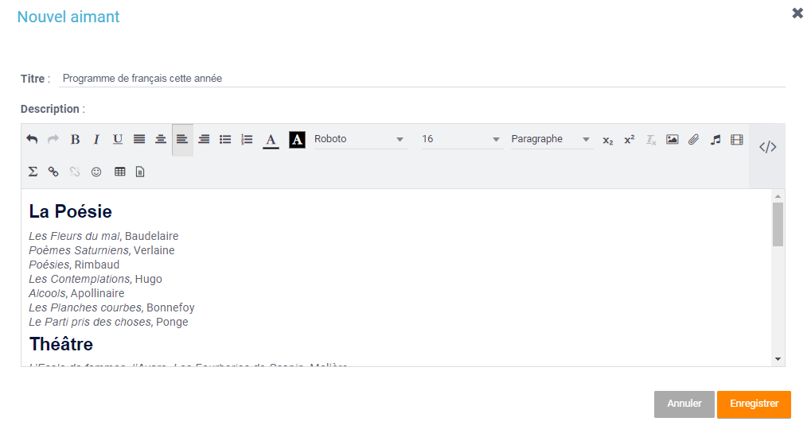

Exemple de création d'un aimant vidéo en plusieurs étapes :

1. D'abord choisir un URL

2. Puis choisir un titre, une légende et description

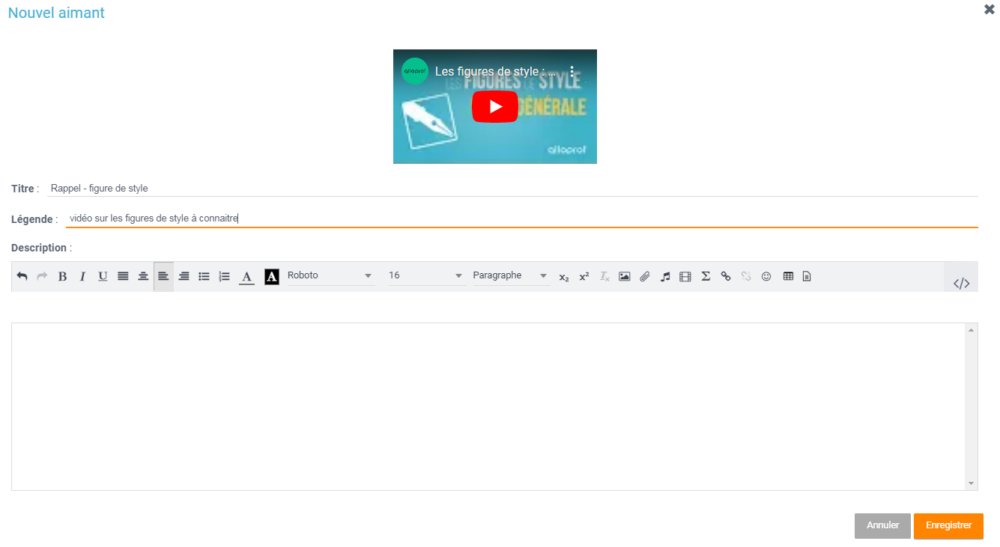

La création de l'aimant se fait directement au clic sur "Enregistrer" et il apparaît sur le tableau. Le type de l'aimant est alors affiché au niveau de la vignette de ce dernier.

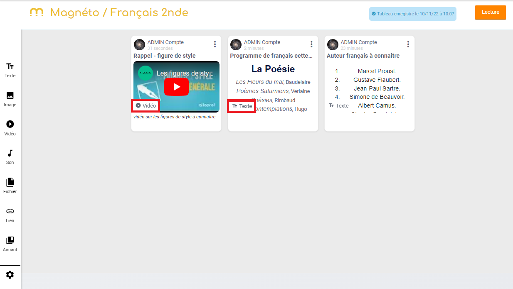

**L'ajout d'aimants depuis d'autres tableaux** se fait depuis l'onglet **Collection** dans le bandeau latéral. Une popup s'ouvre alors. Elle présente ses propres aimants de ses autres tableaux (1), les aimants des tableaux qui ont été partagés avec nous avec les droits appropriés (2), les aimants des tableaux partagés à l'échelle de la plateforme (3).

Il est possible de **faire une recherche par mot clés** (4). L'affichage des résultats peut se faire par tableau ou non. Si le choix "par tableau" est sélectionné, il est alors possible d'afficher tous les aimants du même tableau si la thématique nous inspire (5).

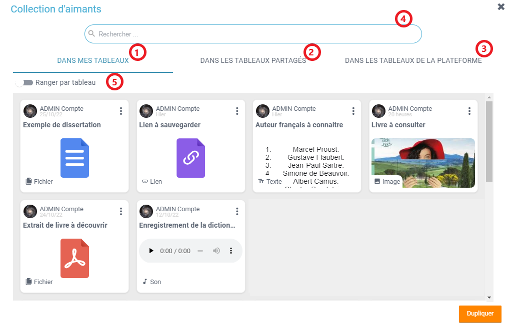

Depuis cette vue, l'utilisateur peut accéder à un **aperçu de l'aimant** pour savoir si l'aimant lui convient. Pour cela, il clique sur les 3 petits points en haut à droite puis sur aperçu. (1)

Si l'aimant lui convient, **il peut alors le dupliquer** :
* soit depuis les 3 petits, (2)

* soit depuis le bouton "Dupliquer" en bas à droite de la pop-up. (3)

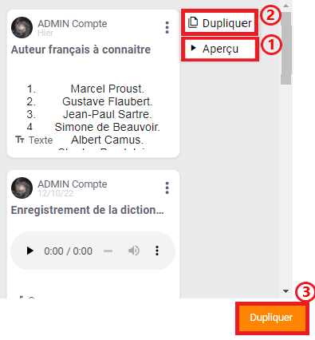

Une fois des aimants disponibles sur le tableau, le **bouton "Lecture" apparaît** en haut à droite.

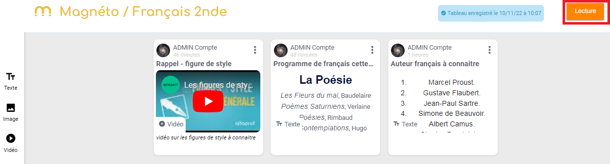

Il permet **d'ouvrir une visionneuse d'aimants** et de naviguer de l'un à l'autre.

## Partage et publication

En cliquant sur 'Partage' dans le menu toaster, **les tableaux peuvent être partagés**.

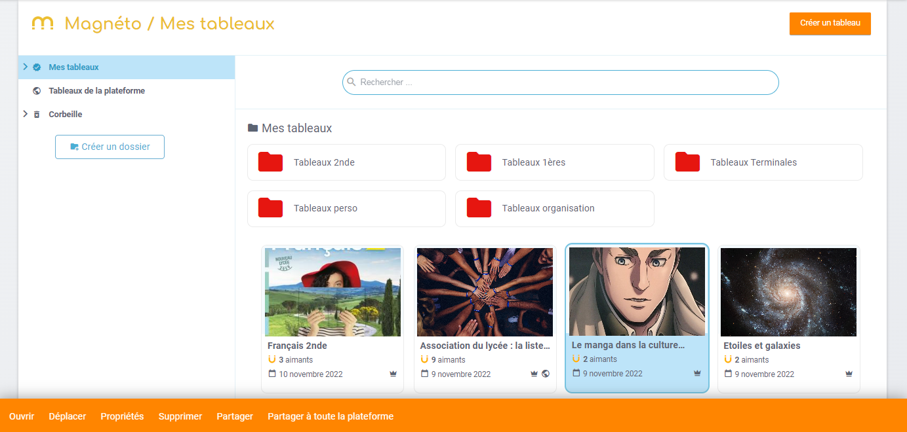

Il existe différents droits :
* **droit de lecture** : les utilisateurs n'accèdent au tableau qu'en mode lecture

* **droit de réutilisation** : les utilisateurs accèdent au tableau en mode lecture, ils peuvent aussi réutiliser les aimants depuis la collection d'aimants

* **droit d'écriture** : les utilisateurs peuvent ajouter des aimants au tableau

* **droit de gestion** : les utilisateurs peuvent ajouter des aimants et modifier les propriétés du tableau.

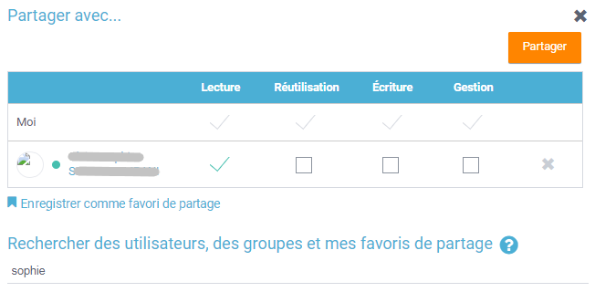

Il est également possible de **mettre un tableau à disposition de toute la plateforme** depuis le toaster et le **bouton "Partager à toute la plateforme"**. Le tableau est ainsi disponible à tous les utilisateurs connectés avec un **droit de réutilisation**. Ils accèderont donc au tableau en mode lecture et pourront en plus dupliquer les aimants sur leurs propres tableaux depuis la collection d'aimants.
Ces tableaux sont disponibles depuis l'arborescence dans l'entrée de menu **Tableaux de la plateforme**. 

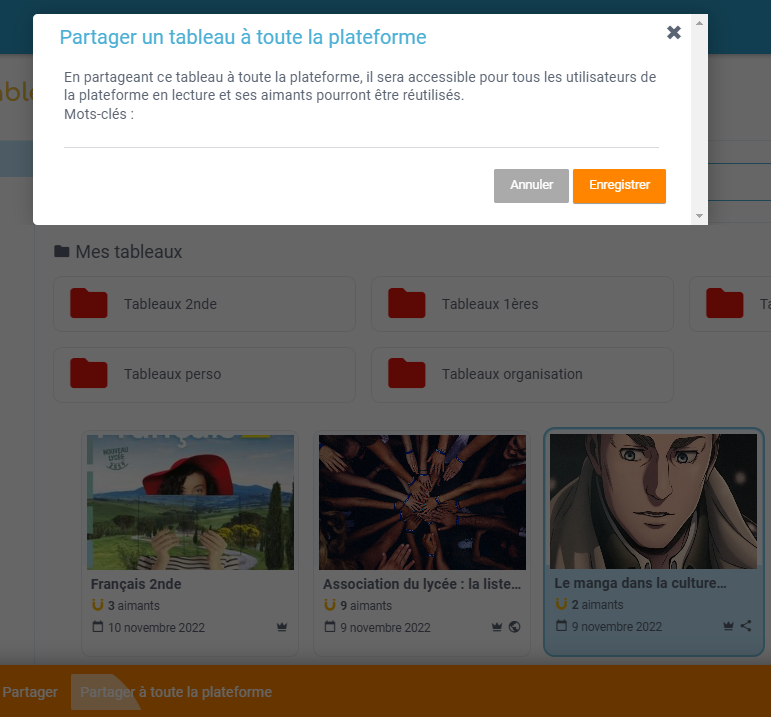
