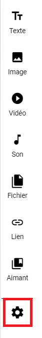
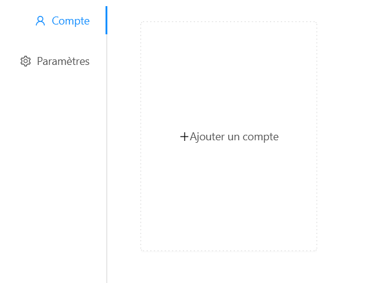
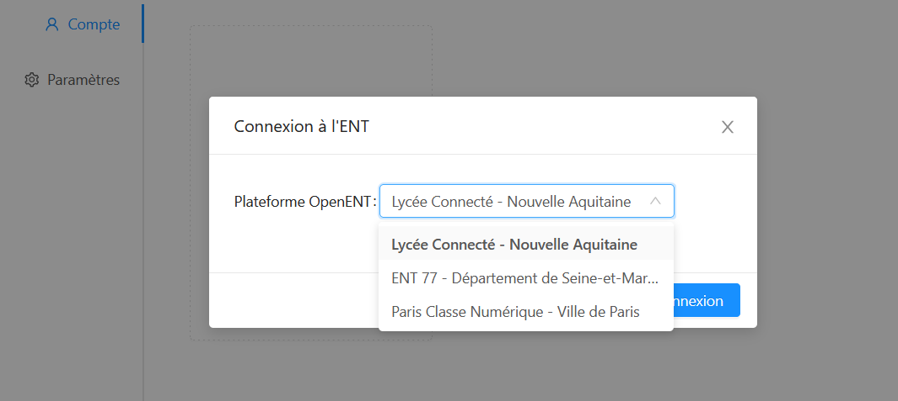
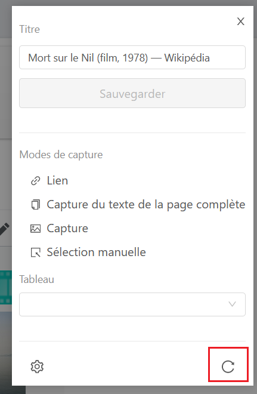
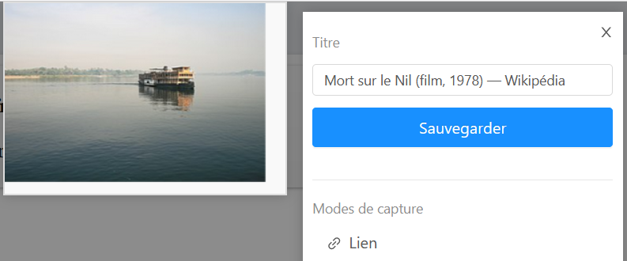

# Magneto

Que ce soit pour préparer des exposés ou des cours, quoi de mieux que de pouvoir agréger tout type de contenus sur un tableau ? Le principe est simple : sur un tableau blanc, ajouter des aimants contenant du contenu multimédia, texte, lien le tout de façon collaborative et en temps réel.

Ces tableaux Magnéto disposent d’une barre de création permettant l’ajout de différents types de contenus y compris du contenu en provenance d’autres tableaux. Une extension web permet également d’agréger du contenu directement pendant sa navigation.

## Créer un tableau

Depuis l'application Magnéto, il est possible de **créer des tableaux blancs depuis le bouton "Créer un tableau"** en haut à droite de la fenêtre.

Une pop up s'ouvre alors. Il est **obligatoire de mettre un titre et une vignette**. La description est optionnelle.
Il est également possible de choisir le mode d'affichage du tableau :
- **libre**
- **sections verticales**
- **sections horizontales**

Vous pouvez choisir d'ajouter des **mots clés** au tableau qui seront utilisés dans la recherche.
Enfin vous pouvez ajouter une **image de fond** à votre tableau. Il faut privilégier une image en mode paysage de bonne qualité.

Au **clic sur "Enregistrer"**, le tableau se crée et l'utilisateur est directement redirigé vers le tableau vide sur lequel il pourra ajouter des aimants.

La collection de tableaux est alors disponible et il est possible de **créer des dossiers pour les ranger**.

Sur la carte des tableaux, des icônes indiquent si les tableaux sont :
* **partagés**  

* **partagés à la communauté**  

* **notre propriété**  

## Ajouter des aimants

L'utilisateur peut **ajouter des aimants sur son tableau à partir de la barre latérale**.
Il existe différents types d'aimants :
* texte

* image

* video

* son

* fichier

* lien

* aimants d'autres tableaux

Au clic sur chaque type d'aimant, une **pop-up s'ouvre avec des données à sélectionner puis des informations à saisir**.

Exemple de création d'un aimant texte :

Exemple de création d'un aimant vidéo en plusieurs étapes :

1. D'abord choisir un URL

    

2. Puis choisir un titre, une légende et description

    

La création de l'aimant se fait directement au clic sur "Enregistrer" et il apparaît sur le tableau. Le type de l'aimant est alors affiché au niveau de la vignette de ce dernier.

**L'ajout d'aimants depuis d'autres tableaux** se fait depuis l'onglet **Collection** dans le bandeau latéral. Une popup s'ouvre alors. Elle présente ses propres aimants de ses autres tableaux (1), les aimants des tableaux qui ont été partagés avec nous avec les droits appropriés (2), les aimants des tableaux partagés à l'échelle de la plateforme (3).

Il est possible de **faire une recherche par mot clés** (4). L'affichage des résultats peut se faire par tableau ou non. Si le choix "par tableau" est sélectionné, il est alors possible d'afficher tous les aimants du même tableau si la thématique nous inspire (5).

Depuis cette vue, l'utilisateur peut accéder à un **aperçu de l'aimant** pour savoir si l'aimant lui convient. Pour cela, il clique sur les 3 petits points en haut à droite puis sur aperçu. (1)

Si l'aimant lui convient, **il peut alors le dupliquer** :
* soit depuis les 3 petits, (2)

* soit depuis le bouton "Dupliquer" en bas à droite de la pop-up. (3)

Une fois des aimants disponibles sur le tableau, le **bouton "Lecture" apparaît** en haut à droite.

Il permet **d'ouvrir une visionneuse d'aimants** et de naviguer de l'un à l'autre.

## Sections

Les tableaux Magnéto peuvent se diviser en sections verticales (colonnes) ou horizontales (lignes).

Ce choix se fait à la création du tableau ou depuis la roue cranté en bas de la barre d'outils.

Une section est créée par défaut si le mode section est choisi. Elle est nommée Section 1 et il est possible d'éditer son nom en cliquant directement sur le nom.
Une section peut être **dupliquée, supprimée et déplacée**.
- A la **suppression** de la section, il est demandé à l'utilisateur **s'il souhaite supprimer tous les aimants** contenus dans la section ou s'il préfère **les déplacer** dans la première section.
- Le déplacement de la section se fait par **glisser-déposer depuis le haut de la section**.

Pour **créer une section** il suffit **d'ajouter un nom dans le champ "nom de section" puis de cliquer sur entrer ou de cliquer n'importe où ailleurs dans la page**. Il est aussi possible de créer automatiquement une section en glissant-déposant un aimant dans la colonne.

## Partage et publication

En cliquant sur 'Partage' dans le menu toaster, **les tableaux peuvent être partagés**.

Il existe différents droits :
* **droit de lecture** : les utilisateurs n'accèdent au tableau qu'en mode lecture

* **droit de réutilisation** : les utilisateurs accèdent au tableau en mode lecture, ils peuvent aussi réutiliser les aimants depuis la collection d'aimants

* **droit d'écriture** : les utilisateurs peuvent ajouter des aimants au tableau

* **droit de gestion** : les utilisateurs peuvent ajouter des aimants et modifier les propriétés du tableau.

Il est également possible de **mettre un tableau à disposition de tous les établissements de la plateforme** depuis le toaster et le **bouton "Partager à toute la plateforme"**. Le tableau est ainsi disponible à tous les utilisateurs connectés avec un **droit de réutilisation**. Ils accèderont donc au tableau en mode lecture et pourront en plus dupliquer les aimants sur leurs propres tableaux depuis la collection d'aimants.
Ces tableaux sont disponibles depuis l'arborescence dans l'entrée de menu **Tableaux de la plateforme**.

## Extensions Navigateur Magnéto

Des extensions navigateurs existent pour vous permettre d'agréger du contenu dans vos tableaux durant votre navigation web. 

* [Extension Chrome](https://chrome.google.com/webstore/detail/magneto-extension/pamjpplklghfnfknbbfegacelfkhjikd "Lien extension Magnéto Chrome")
* [Extension Firefox](https://addons.mozilla.org/fr/firefox/addon/magneto_extension/ "Lien extension Magnéto Firefox")

Installez l'extension, puis lors de votre navigation, cliquer dessus.
Il vous sera demandé de vous connecter en choisissant votre ENT.

Une fois connecté, actualisez la page ou l'extension.

Vos tableaux sont désormais disponibles et vous pouvez sélectionner celui dans lequel vous souhaitez créer des aimants.

Il suffit ensuite de cliquer sur les modes de capture de votre choix :

* Lien : crée un aimant "Lien" en prenant le lien de la page web sur laquelle vous vous trouvez
* Capture du texte de la page complète : crée un aimant "texte" avec tout le contenu de la page web
* Capture : vous permet de réaliser une capture d'écran et cela crée un aimant "image"
* Sélection manuelle : vous permet de choisir l'élément de la page à copier et crée un aimant "texte"

Cliquez enfin sur Sauvegarder après avoir renseigné le titre de l'aimant.

Un feedback vous indique si l'aimant a bien été créé et vous propose d'accéder au tableau Magnéto.

