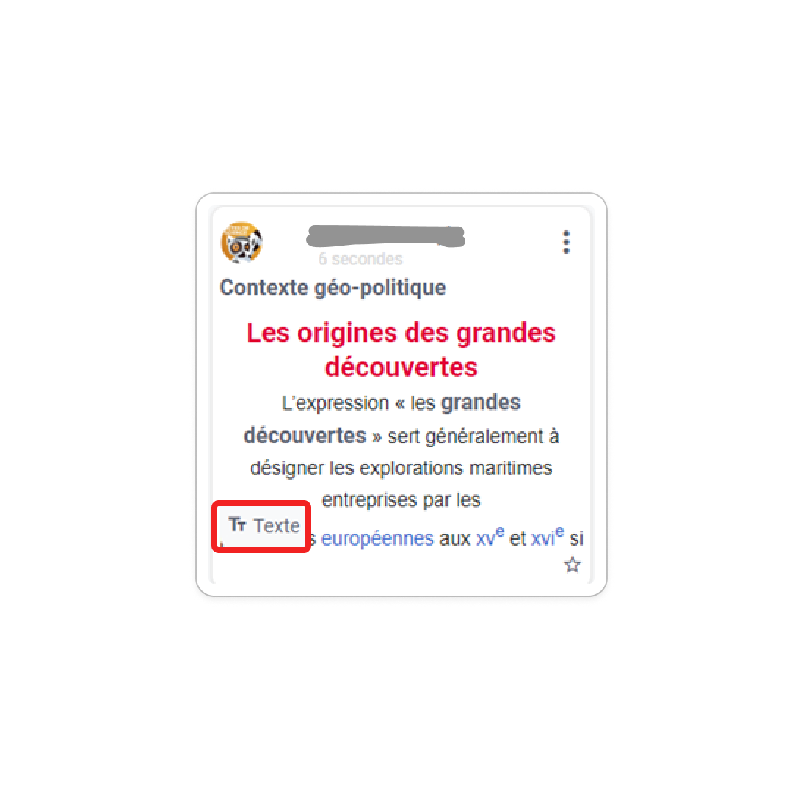

# Magneto

Avec Magnéto, ajoutez des tableaux et des aimants pour organisez vos pensées, vos ressources et vos idées ! 

## Présentation

Que ce soit pour préparer des exposés ou des cours, quoi de mieux que de pouvoir agréger tout type de contenus sur un tableau ? Le principe est simple : sur un tableau blanc, ajouter des aimants contenant du contenu multimédia, texte, lien ou tout autre fichier le tout de façon collaborative et en temps réel.

Ces tableaux Magnéto disposent d’une barre de création permettant l’ajout de différents types de contenus y compris du contenu en provenance d’autres tableaux. Une extension web permet également d’agréger du contenu directement pendant sa navigation.

## Les tableaux

Depuis l'application Magnéto, il est possible de **créer des tableaux blancs depuis le bouton "Créer un tableau"** en haut à droite de la fenêtre.

Une pop up s'ouvre alors afin de paramétrer les caractéristiques de ce tableau. 

Il est **obligatoire de mettre un titre (1) et une vignette (2)**. La description (3) est optionnelle. Des options (4) permettent de donner des droits d’actions aux utilisateurs.
Il est également possible de choisir le mode d'affichage du tableau (5) :

* **libre**
* **sections verticales**
* **sections horizontales**

Pour plus d’informations sur ces différents affichages, il faut se référer au paragraphe des sections.

Vous pouvez choisir d'ajouter des **mots clés (6)** au tableau qui seront utilisés dans la recherche.
Enfin vous pouvez ajouter une **image de fond (7)** à votre tableau. Il faut privilégier une image de bonne qualité.

Au **clic sur "Enregistrer"**, le tableau se crée et l'utilisateur est directement redirigé vers le tableau vide sur lequel il pourra ajouter des aimants.

Sur la carte d'un tableau, des icônes sont visibles. 

Elles indiquent si le tableau est :

* **partagé**  

* **partagé à la plateforme**  

* **notre propriété**  

*  **la propriété de quelqu'un d'autre**  

**ACTIONS SUR LES TABLEAUX**

En cliquant sur la carte d’un tableau créé, il est possible d’effectuer différentes actions via le menu d’action orange qui s’affiche en bas de l’écran :  

* **Ouvrir :** pour accéder au contenu d'un tableau

* **Propriétés :** pour modifier les propriétés du tableaux  (définies lors de sa création et modifiables à tout moment)

* **Déplacer :** pour déplacer le tableau dans un dossier particulier

* **Partager :** pour partager le tableau à d’autres utilisateurs (cf paragraphe « partager un tableau »)

* **Partager à toute la platforme :** pour partager le tableau à toute la plateforme (cf paragraphe « Tableaux de la plateforme »)

* **Supprimer :** pour déplacer le tableau dans la corbeille

**MODE LECTURE D'UN TABLEAU**

Le mode lecture permet de **consulter tous les aimants du tableau les uns après les autres**, comme pour la lecture d’un diaporama. 

Une fois des aimants disponibles sur le tableau, le **bouton "Lecture" apparaît** en haut à droite.

Il permet **d'ouvrir une visionneuse d'aimants** et de naviguer de l'un à l'autre, grâce aux flèches sur les côtés. Un menu permet de sélectionner une section en particulier, pour les tableaux ayant des sections.

**ORGANISATION EN DOSSIERS**

Une fois vos premiers tableaux créés, il est possible de **créer des dossiers pour les ranger.**

Pour cela, le bouton    est disponible sous le menu de gauche. Il suffit d’entrer le nom du dossier puis de cliquer sur « Enregistrer » pour qu’il soit créé. 
Il est possible de **renommer** et **supprimer** un dossier de la même manière qu’un tableau. Il est aussi possible de **partager** un dossier (cf paragraphe sur le partage de dossiers).

## Tableaux de la plateforme

La plateforme est un ensemble d’établissements commun à une même région. Il est possible de **partager des tableaux à l’ensemble des utilisateurs de la plateforme.** Ces tableaux sont accessibles en droit réutilisation seulement. Les autres utilisateurs de la plateforme pourront donc dupliquer les aimants dans leurs propres tableaux sans modifier le contenu de votre tableau. Les tableaux partagés à la plateforme sont **disponibles dans l’onglet « Tableaux de la plateforme »** dans l’arborescence de dossiers du menu. 

Pour partager un tableau sur la plateforme, il faut sélectionner le tableau et cliquer sur le bouton **« Partager à toute la plateforme »** depuis le menu via le menu d’action orange en bas de l’écran.

Une icône monde est présente sur tous les tableaux partagés à la plateforme.

## Les aimants

Les aimants sont des éléments constitutifs du tableau représentant des idées, des arguments, des illustrations...

Il existe différents types d'aimants :

* **Les aimants "Texte"** permettent de présenter du contenu textuel, avec la possibilité de créer des paragraphes enrichis, comme sur un éditeur de texte.

* **Les aimants "Image"** permettent d’ajouter une illustration à laquelle il est possible d’associer une description. 

* **Les aimants "Multimédia"** permettent d'ajouter différents contenus multimédias tels que des vidéos Youtube/Dailymotion/Peertube/Viméo ou vos propres contenus multimédias.

* **Les aimants "Son"** permettent de créer des audios, des mémos vocaux ou n’importe quel autre contenu mp3.

* **Les aimants "Fichier"** sont créés dans le cas où l’on souhaite importer des fichiers en tous genre. Un lecteur de PDF et d’autres fichiers de la suite bureautique (Excel, Word, etc) est intégré dans Magnéto, permettant de les visualiser facilement et de les modifier dans l’application OnlyOffice directement.

* **Les aimants "Lien"** permettent de créer des liens vers des sites externes ou vers d’autres ressources de l’ENT.

* **Les aimants "Aimant"** permettent de récupérer les aimants présents dans d'autres tableaux.

**CREER DES AIMANTS**

L'utilisateur peut **ajouter des aimants sur son tableau à partir de la barre latérale.**

Au clic sur chaque type d'aimant, une **pop-up s'ouvre avec des données à sélectionner puis des informations à saisir**.

Exemple de création d'un aimant texte :

Exemple de création d'un aimant vidéo en plusieurs étapes :

1. D'abord choisir un URL

    

2. Puis choisir un titre, une légende et description

    

La création de l'aimant se fait directement au clic sur "Enregistrer" et il apparaît sur le tableau. Le type de l'aimant est alors affiché au niveau de la vignette de ce dernier.

**L'ajout d'aimants depuis d'autres tableaux** se fait depuis la vignette  
dans le bandeau latéral. Une popup s'ouvre alors. 

Elle présente les aimants présents dans ses propres tableaux (1), les aimants des tableaux qui ont été partagés avec nous avec les droits appropriés (2), les aimants des tableaux partagés à l'échelle de la plateforme (3) et les aimants mis en favoris (4).

Il est possible de **faire une recherche par mot clés** (5). L'affichage des résultats peut se faire par tableau ou non. Si le choix "Ranger par tableau" est sélectionné, il est alors possible d'afficher tous les aimants du même tableau (6). Si le choix « Trier par favoris » est sélectionné (7), les aimants mis en favoris sont mis en avant.

**ACTIONS SUR LES AIMANTS**

Une fois les aimants créés, il est possible d’effectuer un certain nombre d’actions sur ces derniers. 

Depuis cette vue, l'utilisateur peut accéder à un **aperçu de l'aimant** pour savoir si l'aimant lui convient. Pour cela, il clique sur les 3 petits points en haut à droite puis sur aperçu. (1)

Si l'aimant lui convient, **il peut alors le dupliquer** en cliquant sur les 3 petits points du menu de l’aimant, puis en sélectionnant « Dupliquer » (3)

Il faut des droits **de réutilisation** minimum sur le tableau pour pouvoir dupliquer les aimants.

**Les aimants sont également éditables.** On peut donc modifier un aimant en mettant à jour son formulaire de création en cliquant sur « Editer » sur le menu de l’aimant (2).

Il faut des droits **d’édition** minimum sur le tableau pour pouvoir modifier les aimants.

Si l’on souhaite **déplacer un aimant dans un autre tableau,** cela est également possible an cliquant sur « Déplacer » dans le menu de l’aimant (4). On peut alors choisir le tableau d’arrivée dans lequel on souhaite le déplacer. Une fois cette action effectuée, l’aimant n’apparaîtra plus dans le tableau actuel.

Si l’on souhaite **le changer de position dans le tableau actuel,** cela est possible grâce au **déplacement en glisser-déposer.** 

Il faut des droits **d’édition** minimum sur le tableau pour pouvoir déplacer les aimants.

Il est possible de **verrouiller un aimant (5),** c’est-à-dire de bloquer l'édition et le déplacement d'un aimant donné pour toute personne non **gestionnaire** ou **propriétaire** de l'aimant.

Lorsqu'un aimant est verrouillé, un petit cadenas apparait sur la carte :

Il faut des droits **de gestion** minimum sur le tableau pour pouvoir verrouiller les aimants.

Un aimant peut également **être supprimé définitivement** du tableau en sélectionnant « Supprimer » (6).

Il faut avoir créé l’aimant soi-même pour pouvoir le supprimer.

**AIMANTS EN FAVORIS**

Il est possible de mettre un aimant en favoris en cliquant sur la petite étoile en bas à droite de l’aimant :

L’étoile se remplie alors et l’aimant est maintenant visible et plus facilement accessible dans les aimants en favoris de la page d’accueil.

Si l’option du tableau « Afficher le nombre de favoris sur les aimants » est coché, un petit nombre est affiché à côté de l’étoile et correspond au nombre de personnes ayant choisi de mettre cet aimant en favoris.

**COMMENTAIRES**

Il est possible de **mettre des commentaires sur les aimants** pour réagir à ces derniers. 

Pour cela, il faut que les propriétés du tableau le permettent et que la case « Permettre aux utilisateurs de commenter les aimants » soient cochées dans les options du tableau.

Le contenu du tableau permet ainsi l’ajout de commentaires : 

Il est possible d’ajouter des commentaires directement sur cet affichage du tableau mais aussi sur le mode aperçu ou le mode lecture en cliquant sur l’icône

Dans le cas d’un affichage du tableau, **seul le dernier commentaire s’affiche.**

Alors qu’en mode aperçu ou en mode lecture, tous les commentaires sont affichés.

Une fois des aimants disponibles sur le tableau, le **bouton "Lecture" apparaît** en haut à droite.

## Les sections

**LES DIFFERENTS TYPES DE SECTION**

Les tableaux Magnéto peuvent se diviser en sections verticales (colonnes) ou horizontales (lignes). Les tableaux Magnéto peuvent se diviser en sections verticales (colonnes) ou horizontales (lignes). Cela permet de séparer des groupes d’aimants pour mieux les organiser. 

Exemple d’un tableau à sections verticales : 

Exemple d’un tableau à sections horizontales : 

Un tableau sans section est dit à disposition libre : 

Ce choix se fait à la création du tableau ou depuis la roue cranté en bas de la barre d'outils.

**CREER UNE SECTION**

Une section nommée "Section 1" est **créée par défaut** si un mode avec sections est choisi. Pour en créer une nouvelle, il suffit d'ajouter un nom dans le champ "Nom de section …" puis de cliquer sur entrer ou de cliquer n'importe où ailleurs dans la page. Il est aussi possible de créer automatiquement une section en glissant-déposant un aimant dans la colonne.

**ACTIONS SUR LES SECTIONS**

Plusieurs actions sont possibles sur les sections : 

* **Renommer une section** : Une section peut être facilement renommée en cliquant directement sur le nom de la section et en inscrivant son nouveau nom. La validation s’effectue en tapant sur la touche « Entrée ».

* **Déplacer une section**: Le déplacement de la section se fait par **glisser-déposer depuis le haut de la section.**

D’autres actions sont disponibles en cliquant sur le menu en haut de la section : 

* **Dupliquer une section (1)** : En cliquant sur le menu de la section, on peut la dupliquer, c’est-à-dire effectuer une copie de celle-ci dans le tableau actuel. Tous les aimants contenant la section sont également dupliqués. 

* **Masquer pour les lecteurs (2)** : Cette option permet de rendre la section et son contenu invisible pour toutes les personnes ayant le droit de lecture sur le tableau.
Au clic sur « Masquer pour les lecteurs » une icône apparaît sur la section pour indiquer son statut.

* **Supprimer la section (3)** : A la **suppression** de la section, il est demandé à l'utilisateur **s'il souhaite supprimer tous les aimants** contenus dans la section ou s'il préfère **les déplacer** dans la première section.

## Le partage

**PARTAGE DE TABLEAUX**

Il est possible de **partager des dossiers ou des tableaux**, afin de favoriser le travail collaboratif. 

Un dossier partagé apparaît différemment d’un dossier standard : 

**LES DIFFERENTS DROITS D'ACCES SUR LES TABLEAUX**

Il existe différents droits :
 
* **droit de lecture** : les utilisateurs n'accèdent au tableau qu'en mode consultation.

* **droit de réutilisation** : les utilisateurs accèdent au tableau en mode lecture, ils peuvent aussi dupliquer les aimants directement depuis le tableau ou depuis la collection d'aimants.

* **droit d'écriture** : les utilisateurs peuvent ajouter des aimants au tableau

* **droit de gestion** : les utilisateurs peuvent ajouter des aimants et modifier les propriétés du tableau.

Chaque droit contient le/les droit(s) qui le précède. Ainsi donner le droit "Écriture" revient à donner les droits "Écriture", "Réutilisation" et "Lecture".

Un propriétaire d’un tableau ou un dossier a tous les droits sur celui-ci, c’est-à-dire qu’il peut également choisir de le partager à d’autres utilisateurs.

**LE PARTAGE DE DOSSIERS**

Il est possible de partager des dossiers contenants des tableaux (et des dossiers) à d’autres utilisateurs de magnéto. Ainsi, lorsque l’on partage un dossier à une tierce personne, tout le contenu du dossier lui est également partagé. 

Par exemple, si l’on crée l’architecture suivante : 

Si l’on souhaite **partager le Dossier 1** avec des droits d’édition, toutes les personnes qui ont accès au Dossier 1 **auront également accès à l’ensemble des éléments du dossier** (c’est-à-dire les tableaux 1 et 2 ainsi que le dossier 2  et son tableau 3). 

Le partage de dossiers fonctionne en suivant quelques règles de gestion :

* Il est possible de **partager un dossier à différents utilisateurs, avec des droits différents.** Il existe 4 droits de partage : lecture, réutilisation, écriture et gestion. Le détail de ces droits est donné plus haut.

* **Le droit du dossier partagé (parent) s’étend sur tous les sous-éléments** du dossier. 

    * **Il est possible d’augmenter ces droits sur les sous-éléments,** par exemple donner à une des personnes des droits de gestion sur le dossier 2. 

    * Cependant, **on ne peut pas diminuer ces droits :** dans notre exemple, il n’est pas possible de réduire ou de supprimer l’accès au dossier 2 aux personnes auxquelles le dossier 1 a été partagé.

* Il est possible de **partager un sous-élément du dossier à des personnes à qui le dossier parent n’a pas été partagé.** Par exemple, il est possible de partager le tableau 1 à quelqu’un à qui le dossier 1 n’a pas été partagé.

* Les personnes à qui le dossier parent a été partagé avec le droit écriture ou gestion peuvent créer des tableaux/dossiers dans le dossier partagé. Toutes les personnes à qui le dossier a été partagé voient alors les contributions faites par ces personnes. 

* Le propriétaire du dossier partagé (parent) devient gestionnaire (= possède le droit gestion) sur tous les éléments créés par d’autres personnes dans son dossier.

* **La suppression d’un dossier partagé supprime les partages** précédemment établis. Tous les éléments du dossier sont **alors transférés dans les corbeilles respectives des propriétaires.** Par exemple, si l‘on supprime le dossier 1, les dossiers créés par l’utilisateur en vert ira sans sa corbeille personnelle et tout comme pour ceux créés par l’utilisateur orange.

## Extensions Navigateur Magnéto

Des extensions navigateurs existent pour vous permettre d'agréger du contenu dans vos tableaux durant votre navigation web. 

* [Extension Chrome](https://chrome.google.com/webstore/detail/magneto-extension/pamjpplklghfnfknbbfegacelfkhjikd "Lien extension Magnéto Chrome")
* [Extension Firefox](https://addons.mozilla.org/fr/firefox/addon/magneto_extension/ "Lien extension Magnéto Firefox")

Installez l'extension, puis lors de votre navigation, cliquer dessus.
Il vous sera demandé de vous connecter en choisissant votre ENT.

Une fois connecté, actualisez la page ou l'extension.

Vos tableaux sont désormais disponibles et vous pouvez sélectionner celui dans lequel vous souhaitez créer des aimants.

Il suffit ensuite de cliquer sur les modes de capture de votre choix :

* Lien : crée un aimant "Lien" en prenant le lien de la page web sur laquelle vous vous trouvez
* Capture du texte de la page complète : crée un aimant "texte" avec tout le contenu de la page web
* Capture : vous permet de réaliser une capture d'écran et cela crée un aimant "image"
* Sélection manuelle : vous permet de choisir l'élément de la page à copier et crée un aimant "texte"

Cliquez enfin sur Sauvegarder après avoir renseigné le titre de l'aimant.

Un feedback vous indique si l'aimant a bien été créé et vous propose d'accéder au tableau Magnéto.

