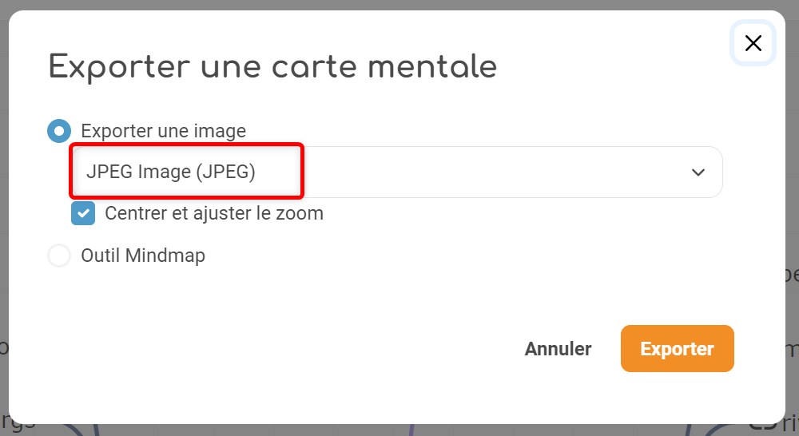

# Carte mentale

1, 2, 3... Brainstormez ! Fatigué de laisser filer vos idées de génie ? L’application **Carte mentale** permet non seulement de les noter, mais aussi d’y relier toutes les réflexions qui en découlent !

## Présentation

L’application Carte mentale permet de **représenter visuellement une arborescence** en créant des liens entre différentes idées. Le schéma se construit autour d’une idée principale, sous forme d’image ou de texte, à partir de laquelle plusieurs chemins se créent.
La carte mentale peut être faite de manière collective ou personnelle, selon les souhaits du créateur de la carte.

## Créer une carte mentale

Pour accéder à l’application **Carte mentale**, cliquez sur l’icône correspondante dans la page **Mes applis**.

Cliquez sur **Créer une carte mentale** en haut à droite de la page.

Vous accédez à l'**interface de création** d'une carte mentale.

1.	Indiquez le **titre** de votre carte : il constitue le nœud de départ.

2.	Renseignez une **description** (optionnel)

3. Ajouter une **vignette d'illustration** de la carte (si vous ne modifiez pas l’image, c’est la vignette par défaut qui s’affichera).

Cliquez sur **Créer** pour valider la création de la carte.

Cliquez sur la vignette de votre carte mentale dans le menu principal pour commencer à la construire.

## Éditer une carte mentale

**Ajouter et supprimer des nœuds**

Pour ajouter de nouvelles notions à un nœud, sélectionnez le nœud de départ et cliquez sur l’icône " **+** " ou tapez directement sur la touche "**entrée**". Le nouveau nœud est créé ainsi que le lien avec le nœud de départ

Pour supprimer un nœud, sélectionnez le nœud et cliquez sur l’icône " **-** " ou tapez directement sur la touche "**supprimer**".

**Mettre en forme le texte**

La **barre d’outils** de la carte mentale vous permet de modifier le format du texte : la police, sa taille, mise en forme et couleur. 

Pour modifier le texte, sélectionnez le nœud ou une partie du texte du nœud et cliquez sur les icônes suivantes dans la barre d’outils.

**Ajouter un lien entre deux nœuds**

Pour ajouter un lien entre deux nœuds, sélectionnez le nœud de départ (1), cliquez sur l’icône "**ajouter un lien**" dans la barre d’outils (2). Une flèche apparaît, cliquez sur le second nœud (3) pour indiquer le point d’arrivée de la flèche.

**Ajouter des contenus complémentaires à un nœud**

Grâce à la barre d’outils de la carte mentale, vous pouvez ajouter à vos nœuds :

* des **émoticônes** (1) : pour faciliter la visualisation et la mémorisation d’une notion
* des **notes** (2) pour compléter le texte du nœud.
* des **liens externes** (3)

Pour ajouter un contenu complémentaire, sélectionnez le nœud et cliquez sur les icônes correspondantes dans la barre d’outils.

Les émoticônes ainsi que les liens et les notes apparaissent sous forme d’icône dans le nœud avant le texte et une visualisation est proposée au survol de l’icône.

Lorsque la carte mentale est terminée, cliquez sur **« Enregistrer »**.
Par sécurité, la sauvegarde est cependant automatique.

## Partager une carte mentale

La carte mentale a été créée mais n’est pas encore visible par les autres utilisateurs.

Pour partager une carte mentale avec d’autres utilisateurs, cliquez sur les 3 petits points sur la carte à partager (1) puis sur "**Partager**" en bas de votre écran (2).

Dans la fenêtre de partage, vous pouvez donner des **droits de lecture, de contribution et de gestion** à d’autres personnes sur votre carte.

Pour cela, saisissez les premières lettres du nom de l’utilisateur ou du groupe d’utilisateurs que vous recherchez (1), sélectionnez le résultat (2) et cochez les cases correspondant aux droits que vous souhaitez leur attribuer (3). 

Cliquez sur "**Partager**" pour valider.

Les différents droits que vous pouvez attribuer sont les suivants :

* **Consulter** : l’utilisateur peut lire le contenu de la carte

* **Contribuer** : l’utilisateur peut apporter des modifications à la carte

* **Gérer** : l’utilisateur peut modifier, supprimer et attribuer des droits de partage sur la carte

## Publier dans la bibliothèque

La **Bibliothèque** est un espace de partage et d’inspiration entre enseignants.

**Publier dans la Bibliothèque**

Si vous souhaitez publier votre carte mentale dans la bibliothèque pour inspirer d’autres enseignants, il vous suffit de cliquer sur les 3 petits points sur la carte à partager "**Publier dans la Bibliothèque**" dans le menu en bas de votre écran.

Vous devez ensuite renseigner les **caractéristiques de votre contenu** pour expliquer votre usage :

* **Titre** : le plus explicatif possible

* **Vignette** : carrée au format JPG ou png

* **Type d’activité** : activité en classe, à la maison, individuelle, en groupe ?

* **Discipline** : Quelle est la discipline concernée par l’activité

* **Langue** : Dans quelle langue est l’activité ?

* **Âge des élèves** : Quel est la tranche d’âge des élèves concernés par l’activité ?

* **Mots-clés** : Quels sont les mots-clés qui caractérisent le mieux votre activité ?

Lorsque votre carte mentale est **publiée**, vous pouvez la visualiser en cliquant sur "**Voir dans la Bibliothèque**".

Vous aurez ensuite la possibilité de **modifier les champs saisis ou de supprimer** la publication de votre carte mentale en cliquant sur **« Modifier »** depuis la page de votre activité.

**Raccourci vers la Bibliothèque**

En tant qu'enseignant, dans la page d’accueil contenant la liste de vos cartes mentales, un encart à gauche vous permet d’accéder rapidement à la Bibliothèque pour récupérer de nouvelles activités.

## Dupliquer une carte mentale

Il n'est pas possible de dupliquer une carte mentale pour le moment.

## Organiser ses cartes mentales

Les cartes mentales peuvent être **rangées et triées dans des dossiers**.

Afin de les organiser, vous disposez de l'arborescence suivante :

* **Mes cartes mentales**, qui est le dossier principal, dans lequel vous pourrez créer tous vos sous-dossiers (grâce au bouton **Nouveau dossier**)

* **Corbeille**, où vous retrouverez les cartes mentales que vous aurez supprimées, pour éviter toute suppression définitive involontaire.

Fonctionnement de la **corbeille** et mise en sourdine :

* Les ressources que vous avez placées ou qu’un auteur/gestionnaire a placées dans votre propre corbeille ne génèrent plus de notifications mails ni de notifications dans le fil de nouveautés.

* Les dossiers placés dans la corbeille sont automatiquement et définitivement supprimés. Les ressources contenues de ces dossiers ne sont cependant pas définitivement supprimées, et s’ajouteront simplement aux autres éléments de la corbeille.

Les ressources restaurées depuis la corbeille se replaceront dans leur dossier d’origine si celui-ci existe toujours. Les notifications seront également ré-activées pour les ressources restaurées.

**Déplacer une carte mentale ou un dossier**

Après avoir créé vos différents dossiers, sélectionnez (1) la carte mentale que vous voulez mettre dans vos dossiers via les 3 petits points, puis cliquez sur le bouton "**Déplacer**" (2)

Une fenêtre s'ouvrira, vous permettant de déplacer la carte mentale sélectionnée dans un dossier existant. 

Il vous est également possible de déplacer des dossiers de la même façon.

## Imprimer et exporter une Carte mentale

**Imprimer une Carte mentale**

En cliquant sur les 3 petits points de votre carte mentale, vous avez la possibilité de l'imprimer, en sélectionnant "**Imprimer**" en bas de votre écran.

**Exporter une Carte mentale**

Il est maintenant possible d'exporter la carte vers différents formats.

Dans la carte que vous souhaitez exporter, cliquez sur le bouton “**Exporter**”.

Choisissez quel format vous préférez dans le menu déroulant, et cliquez sur “**Exporter**”.

Il n'est pas possible d'importer une Carte mentale.