# Le module Moodle

## Origines

Le module Moodle intégré à l'ENT a été pensé pour **faciliter l'approche de Moodle pour les enseignants les moins expérimentés** dans le domaine des plateformes d'e-learning.
L'idée était donc de bénéficier de l'ergonomie de l'ENT pour favoriser les usages les plus simples sur Moodle.

Cette intégration permettait aussi **d'accéder directement à l'annuaire de l'ENT** et d'ainsi disposer de ses classes, groupes, collègues selon les autorisations de communication paramétrées par l'établissement.

Enfin cette intégration nous a permis **d'ajouter des fonctionnalités d'organisation** qui n'existent pas dans Moodle et qui facilitent le travail des enseignants.

## Accéder à ses parcours et activités : Tableau de bord
Le **tableau de bord** de Moodle a été déporté dans l'ENT pour un accès plus immédiat aux ressources.

**Parcours et activités à faire**

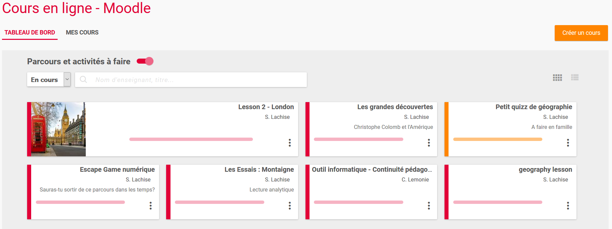

Cette section présente les **différents parcours dans lesquels vous êtes inscrits en tant qu'apprenant**. Ils sont rangés dans l'ordre antéchronologique, le premier qui apparaît étant le dernier sur lequel vous avez été inscrit.

Dans cette section, vous pouvez :

* **La désactiver** à l'aide du bouton à droite du titre : pratique si elle contient des cours de test que vous ne souhaitez pas voir à chaque ouverture du module

* **Tagguer un parcours comme favori** : à l'aide des 3 petits points en bas à droite de chaque parcours. Vous pourrez ainsi filtrer vos parcours favoris à l'aide du menu déroulant situé sous le titre.

  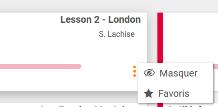

* **Masquer un parcours** : à l'aide des 3 petits points en bas à droite de chaque parcours. Vous pouvez retrouver ces parcours masqués à l'aide du menu déroulant situé sous le titre.

* **Accéder à vos parcours terminés** : si toutes les activités du parcours Moodle sont terminées, le parcours passe dans "Cours terminés". Cela a été fait pour éviter de polluer le tableau de bord une fois les cours achevés. Si vous ajoutez des activités au fur et à mesure, pensez à indiquer aux élèves d'aller chercher les parcours dans "terminés" et éventuellement de les taguer comme favoris.

  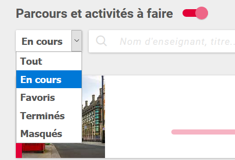

* **Rechercher un cours** : si trop de cours sont dans cette section, il est possible d'en chercher un spécifiquement en tapant le nom de l'enseignant ou en tapant des mots de son titre.

* **Afficher sous forme de cartes ou des lignes** : à l'aide des icônes en haut à droite.

  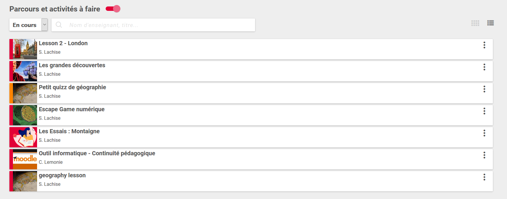

Par ailleurs sur chaque carte de cours, une barre horizontale vous permet d'avoir un aperçu de votre progression au sein du parcours.

**Parcours et activités à venir**

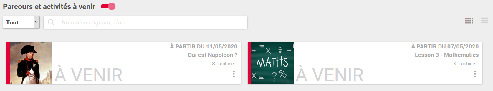

Apparaissent ici **les parcours dont le début a été positionné dans le futur**.
En effet, il est possible dans les paramètres d'un cours Moodle de mettre le début du cours à une date postérieure. Cela nous permet dans le module Moodle de faire un peu de teasing... Le cours est affiché, mais n'est pas accessible. Il le devient à partir de la date définie et passe dans la section du dessus.

**Mes dernières créations**

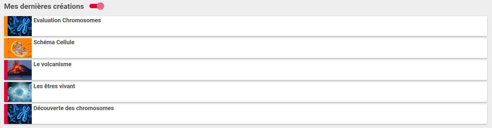

Il s'agit là des **5 derniers cours que vous avez créés** permettant ainsi d'y accéder rapidement.
Pour bénéficier des fonctionnalités les concernant, il faut toutefois passer dans l'onglet Mes cours.

## Accéder à ses créations : Mes cours

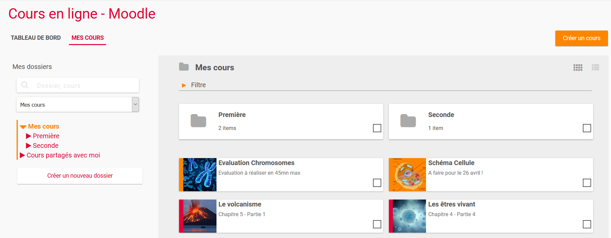

L’onglet MES COURS comporte tous les parcours et activités que vous avez créés. C'est là que réside **l'innovation principale vis-à-vis de Moodle**.
En effet, cet onglet qui se comporte comme l'espace documentaire de l'ENT vous permet de **ranger vos cours**, ce qui n'est pas possible dans Moodle.

Il vous est ainsi possible de **créer des dossiers et d'y glisser-déposer vos cours.** L'avantage principal de cette pratique est la possibilité de faire des cours plus petits et donc plus facilement sauvegardables et restaurables à terme dans un autre Moodle.

Pour créer un dossier, il suffit de **cliquer sur le bouton "Créer un nouveau dossier"**.

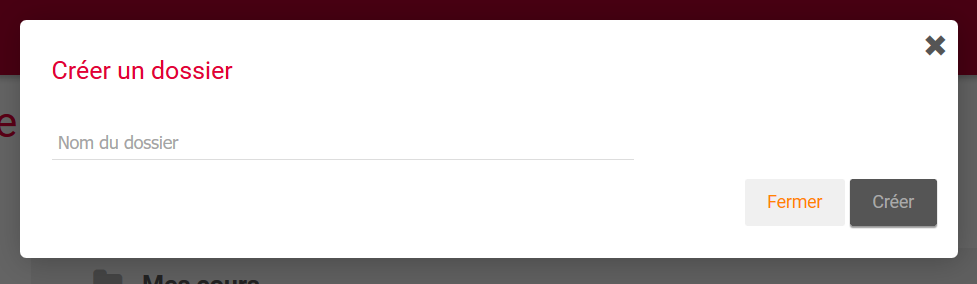

C'est depuis cet onglet aussi que vous allez pouvoir découvrir les principales fonctionnalités du module :

* **Créer un parcours ou une activité** depuis le bouton "Créer un cours" en haut à droite

* **Inscrire des utilisateurs à un cours**

* **Supprimer le cours**

* **Dupliquer le cours**

* **Publier le cours**

* **Déplacer le cours**

## Créer un parcours ou une activité

Il est possible et même obligatoire pour certaines fonctionnalités, de passer par le module Moodle de l’ENT.

**La création d'un parcours Moodle ne peut se faire que depuis le module Moodle de l'ENT.**
Depuis le tableau de bord ou l'onglet Mes cours, un **bouton "Créer un cours"** vous permet d'ouvrir une fenêtre de création de parcours.

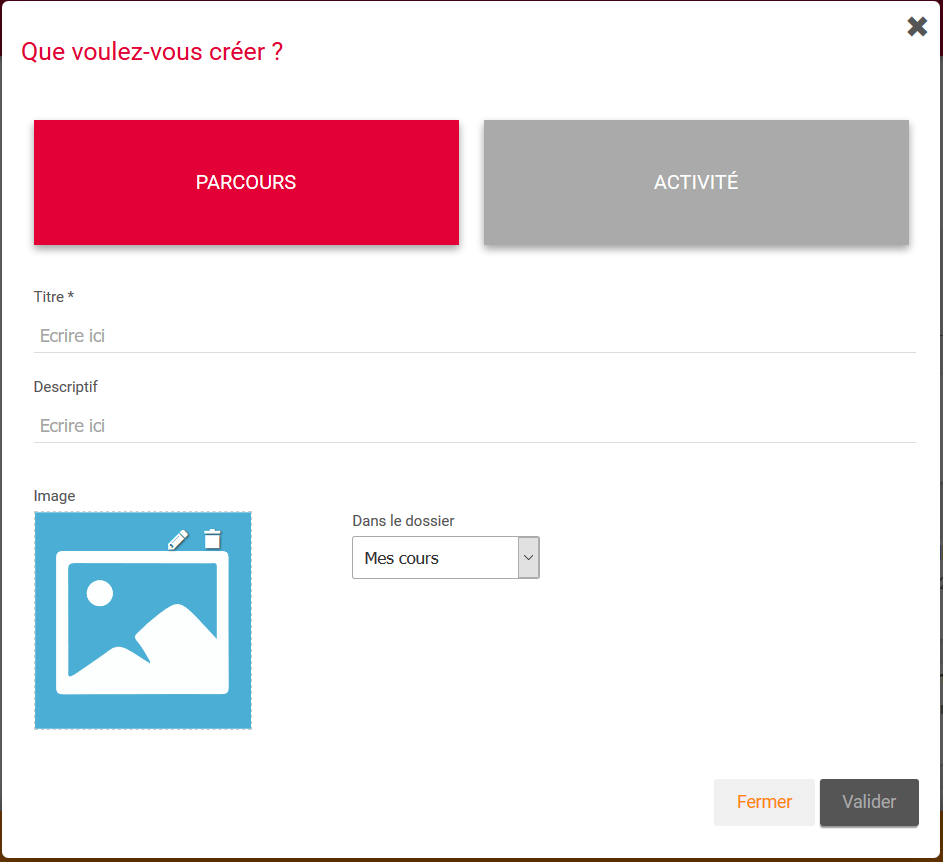

Dans cette fenêtre, vous pouvez choisir entre parcours et activité :

* **Un parcours peut comporter plusieurs activités** que vous créerez directement dans Moodle
* **Une activité correspond dans le jargon Moodle au "parcours activité unique"**. Pas de progression possible, cette fonctionnalité vous permet de créer très rapidement un test ou une activité H5P.

Il est utile d'entrer une **petite description** qui s'affichera sur le tableau de bord des apprenants. **L'image aussi leur permettra de distinguer votre cours**. Cette image peut être chargée directement depuis votre ordinateur ou depuis l'espace documentaire de l'ENT.

Enfin, si vous avez créé des dossiers vous pouvez choisir dans cette fenêtre de créer le cours dans le dossier de votre choix.

**En cliquant sur "Valider", un nouvel onglet s'ouvre**. Vous êtes alors dans Moodle et pouvez commencer à ajouter du contenu à votre cours.

## Inscrire des participants

Une fois votre cours créé, vous pouvez **le partager à des utilisateurs**, mais cette action ne **se fait que depuis le module Moodle**.
En effet, pour inscrire des personnes, il vous faut **accéder à l'annuaire de l'ENT**.

Sélectionnez un cours, dans le "toaster", **cliquez sur "Inscrire"**.
La fenêtre de partage de l'ENT s'ouvre et vous pouvez choisir **d'inscrire des utilisateurs, des classes, des groupes, des favoris de partage en apprenant ou en éditeur**.

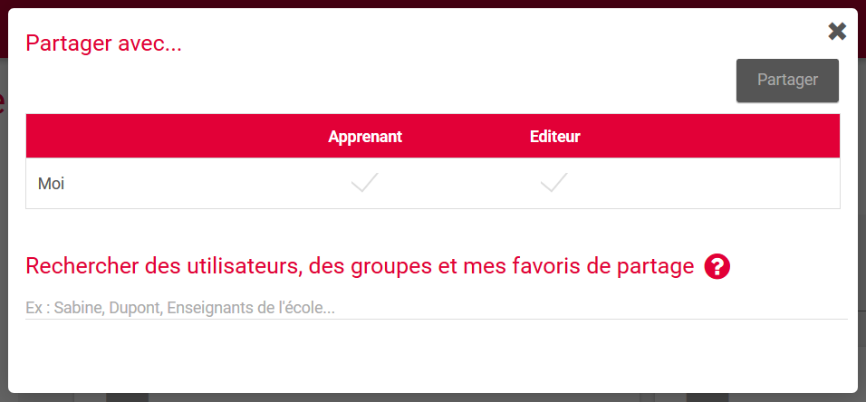

**En apprenant, ils prennent le rôle "élève"** et peuvent suivre le parcours et réaliser les activités sans le modifier.
**En éditeur, ils prennent le rôle "enseignant"** et peuvent modifier les activités, en ajouter et repartager le cours.
**Votre rôle en tant que créateur de cours s'appelle le rôle "auditeur"** : vous disposez de tous les droits sur votre parcours.

Si vous inscrivez une classe, à terme, cette **méthode d'inscription sera synchronisée**. Ainsi, si de nouveaux élèves intègrent la classe, ils auront directement accès au cours sans aucune action nécessaire de votre part.

## Dupliquer un cours

La **fonction de duplication d'un cours n'existe pas en tant que telle dans Moodle**. Il faut sauvegarder une archive du cours et la restaurer ensuite dans un nouveau cours.
Cette procédure a été facilitée depuis le module Moodle. En sélectionnant un cours, vous pouvez **cliquer sur "Dupliquer"** dans le toaster. Une fenêtre de confirmation vous indique que votre demande va être traitée.

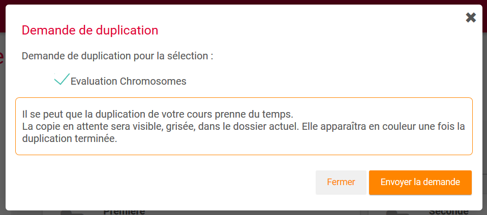

Si vous êtes seul à réaliser une duplication à ce moment et que votre parcours n'est pas trop lourd, la duplication prendra quelques secondes (il faut parfois actualiser la page pour voir le cours apparaître). Si en revanche de nombreux utilisateurs réalisent une duplication et que votre parcours est lourd, il faudra être un peu patient, mais votre cours dupliqué finira par arriver.

Quand la duplication est en cours, une carte grisée vous l'indique.

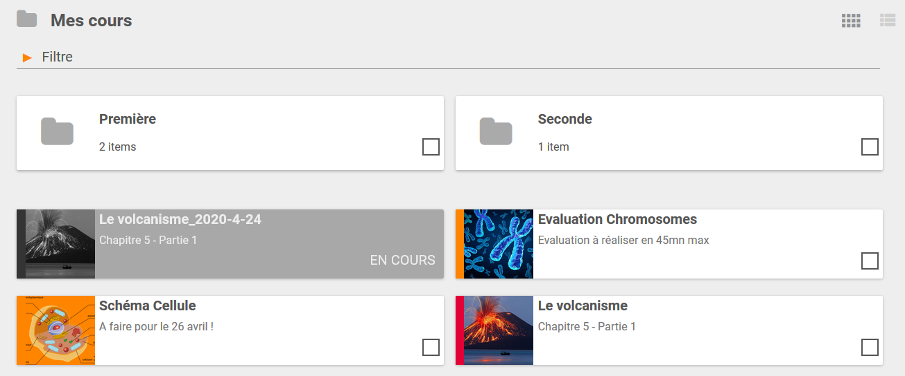

Quand la duplication est terminée, le cours est positionné à côté de l'original avec la date de la duplication dans son nom.

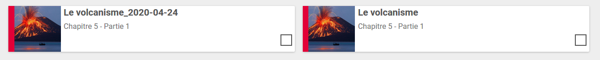

Cette fonctionnalité est **utile lors d'une transition d'année** si vous souhaitez que vos anciens élèves continuent d'accéder à vos parcours de l'année n-1. Vous dupliquez votre parcours, vous rangez le parcours initial dans un dossier et vous repartez sur un parcours dupliqué neuf.
C'est aussi utile si vous souhaitez faire des parcours légèrement différents entre chaque classe. Dupliquez la base puis modifiez les activités. Partagez ensuite chaque cours avec la bonne classe.

## Publier un cours

Il est aussi possible de **publier un parcours Moodle dans le Médiacentre** afin que d'autres enseignants puissent s'en emparer, le retravailler et l'utiliser à leur tour.
Cela passe par le **bouton "Publier"** du toaster qui ouvre une fenêtre de publication vous demandant de remplir des champs de niveau, discipline ainsi que des mots clés. **Si ces champs sont bien remplis, il sera plus simple de retrouver votre parcours dans le Médiacentre.**

Une fois le parcours publié (en réalité il est dupliqué dans une catégorie à part), **il sera disponible dans les résultats de recherche du Médiacentre**. Les autres enseignants pourront alors le dupliquer dans leur module Moodle.

Vous gardez donc toujours l'original dans Vos cours, le parcours publié est toujours votre propriété et vous pouvez le modifier en ligne ou le supprimer à tout moment depuis le dossier "Cours publiés" dans l'onglet Mes cours.

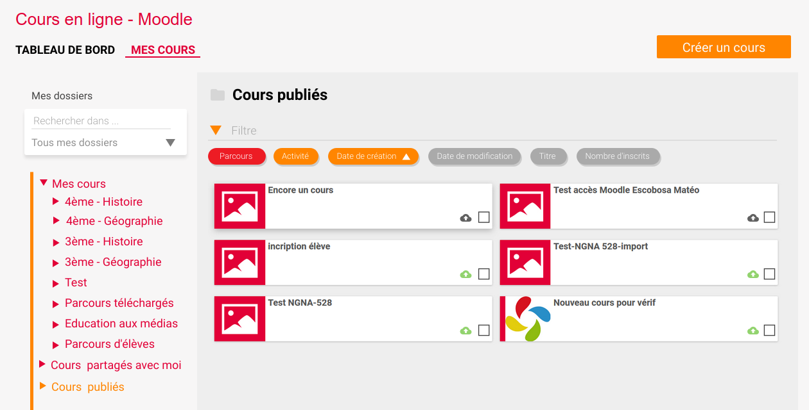

Une fois qu'un autre utilisateur duplique votre cours, vous n'aurez plus la main pour modifier ce cours dupliqué, mais votre nom reste rattaché au parcours pour des questions de propriété intellectuelle. Si la personne repartage votre cours, votre nom apparaîtra comme auteur initial.

# Supprimer, déplacer un cours

Enfin des fonctions simples de suppression et déplacement sont disponibles dans le toaster. Des fenêtres de confirmation vous demanderont de valider votre choix.

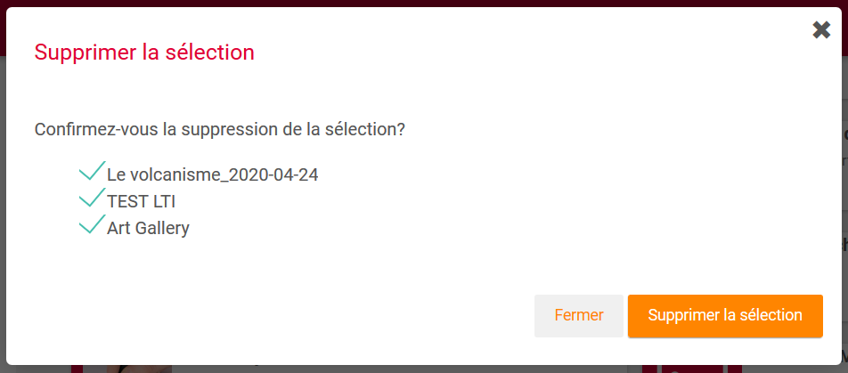

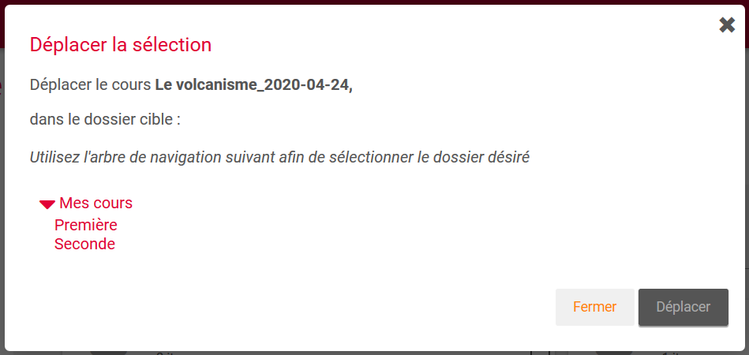
