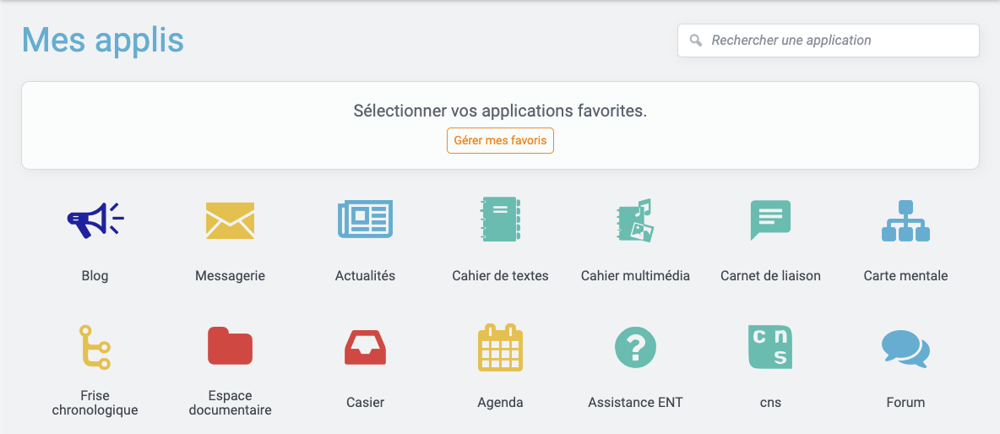
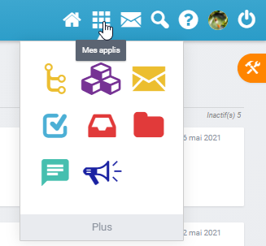
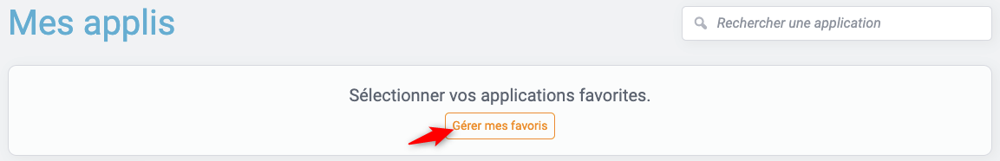
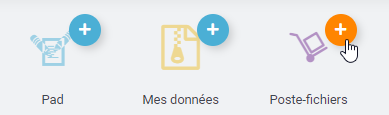
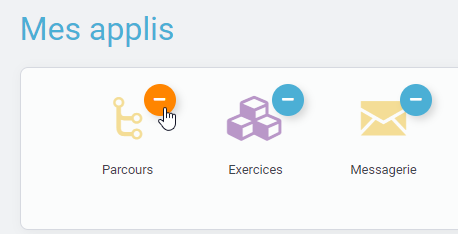
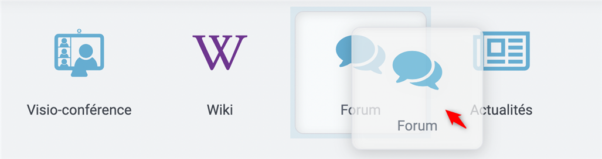

# Mes applis

## Accéder à mes applis

Pour accéder à vos applis, cliquez sur l’icône correspondante dans le bandeau de navigation.

Vous accédez aux services pour lesquels vous avez des droits d’accès : applications, connecteurs aux outils de vie scolaire, sites web internes au réseau ou publics …

Pour accéder à une appli, cliquez sur l’icône correspondante.

La page d’accueil de l’appli apparaît.

## Gestion des favoris

La gestion des favoris vous permet d’accéder rapidement à vos applications préférées. Le menu des favoris est accessible directement depuis l’icône du bandeau de navigation.

Pour ajouter une application dans les favoris, cliquez sur le bouton “Gérer mes favoris” et cliquez sur l'icône “+” au-dessus des applications souhaitées.

Pour supprimer une application en favori, cliquez sur le bouton “Gérer mes favoris” et cliquez sur l'icône “-” au-dessus des applications à retirer des favoris.

## Réorganiser les icônes d’applications

La page des applications permet de déplacer les icônes pour les afficher dans l’ordre de votre choix. Pour déplacer une icône, cliquez dessus et glissez-là à l’endroit souhaité.

