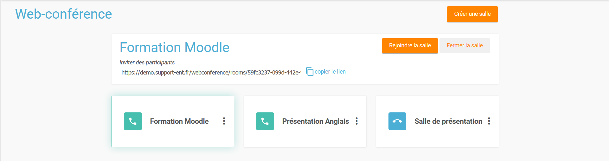
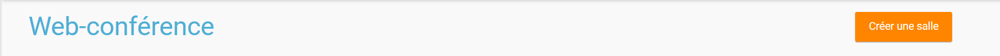
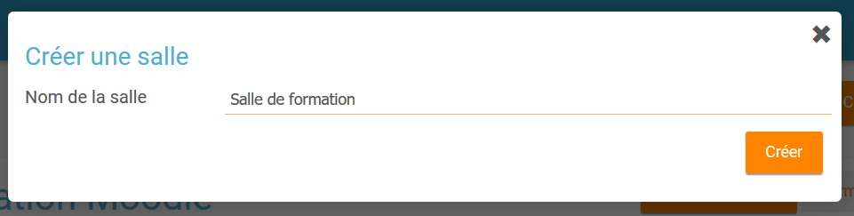
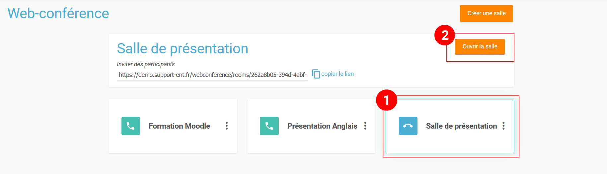
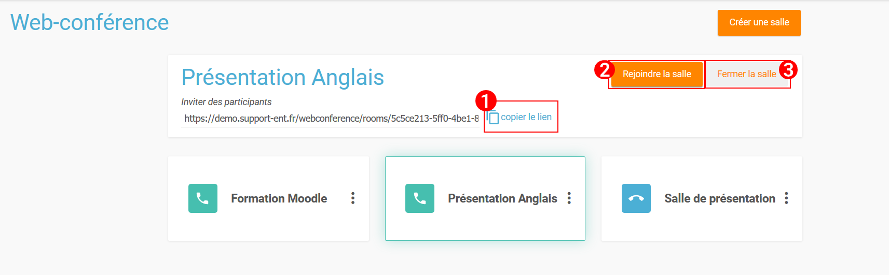
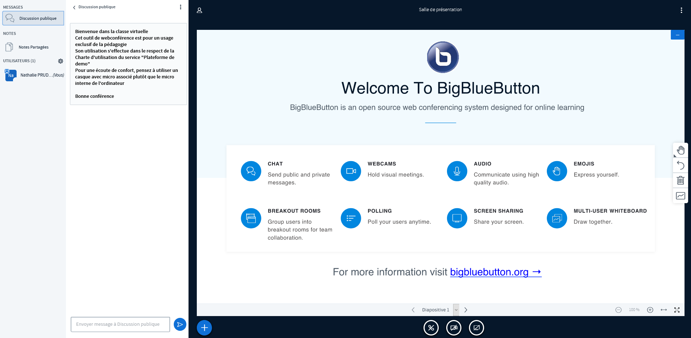
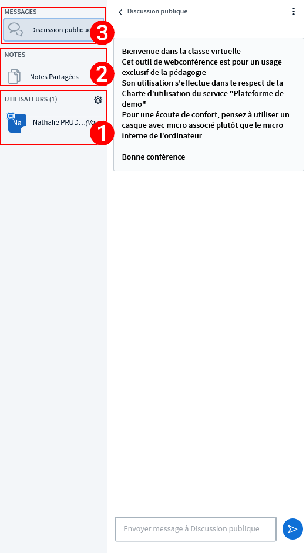
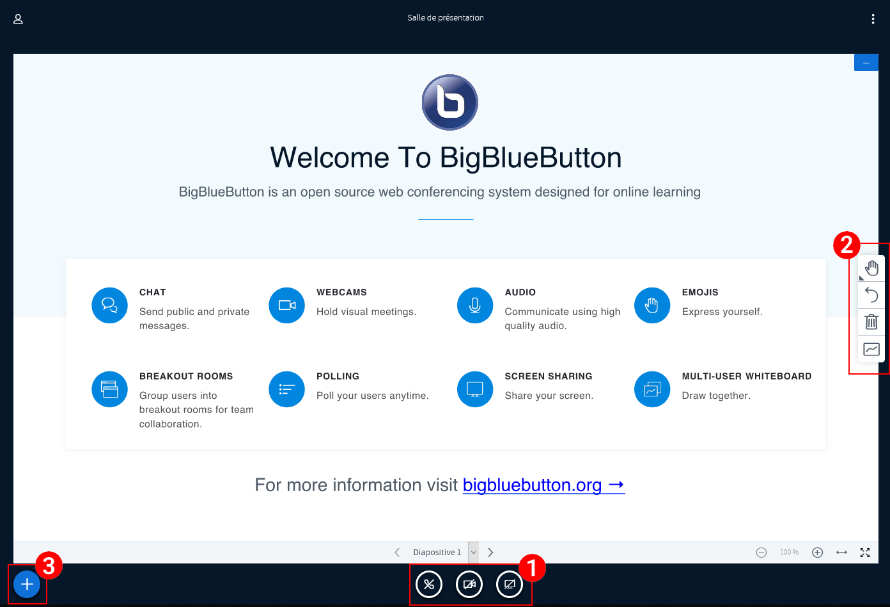

# Visioconférence

## Présentation

L’application **Visioconférence** permet de créer et de partager des salles de visioconférences aux utilisateurs de la plateforme. La liste de vos salles créées est affichée et vous pouvez les gérer directement depuis cet écran. 

## Créer, gérer et partager une salle

Sur la page d'accueil de l'application visioconférence, cliquez sur le bouton **« Créer une salle »** pour créer une nouvelle salle. 

Saisissez le nom de votre salle, puis cliquez sur **« Créer »**. 

La salle créée apparaît dans la liste de vos salles. Elle est fermée par défaut. Pour ouvrir une salle, sélectionnez la salle en cliquant dessus \(1\) et cliquez sur **« Ouvrir la salle »** \(2\). 

Une fois la salle ouverte, vous pouvez la **rejoindre** \(1\), la **fermer** \(2\) et copier le lien à partager pour **inviter des participants** à rejoindre votre salle \(3\). 

Pour **inviter des utilisateurs de la plateforme** à rejoindre votre salle de visioconférence, il suffit de leur transmettre le lien copié. Après connexion, les utilisateurs seront redirigés directement sur la page de la conférence.

## Gérer ma visioconférence

Une fois connecté sur la **salle de visioconférence**, vous pouvez gérer différents aspects de la conférence, tels que la présentation, la diffusion de contenu, les participants … 

Le panel de gauche vous permet de voir et gérer la **liste des utilisateurs connectés** à votre visioconférence \(1\), d’accéder au **notes partagées** \(2\) et à la **discussion \(chat\) de groupe** \(3\). 

Sur la seconde partie de l’écran, vous pouvez choisir de partager ou non votre webcam, votre micro ou votre écran \(1\), d’y ajouter des **annotations en direct** pour les utilisateurs connectés \(2\). Il vous est aussi possible de **charger un document**, de créer un **sondage en direct** ou de **partager une vidéo externe** \(3\). 

